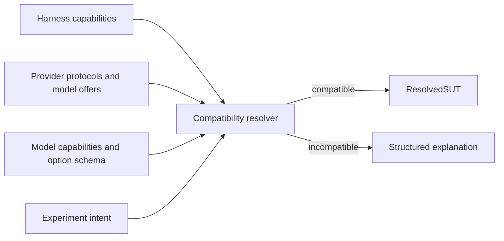

# Polymorphic Harness, Provider, and Model Adapters

**Status:** Accepted
**Date:** 2026-08-23

## Objective

Ralph Bench treats harnesses, providers, and models as three independently
extensible polymorphic axes. A run is assembled by resolving one implementation
of each axis and negotiating their capabilities. The conductor depends on
stable protocols, not vendor names or a growing matrix of special-case
branches.

The user-facing CLI calls an agentic harness a **client**. In the core, its
protocol is named `HarnessAdapter` to distinguish it from HTTP/API clients.

```text
HarnessAdapter x ProviderAdapter x ModelAdapter -> ResolvedSUT
```

The desired structure is compositional:

```text
Codex CLI + ChatGPT-managed access + Luna profile
Codex CLI + OpenAI + GPT profile
OpenCode + LM Studio + Qwen profile
generic command harness + OpenAI-compatible provider + generic model profile
Pi + Pi-wiggum workflow + local provider + local model profile
```

The first composition established the initial live path. The Pi/Wiggum local
execution path is now prepared as the next real composition, using a local
model served by LM Studio to prove that the contracts work beyond Codex.
Wiggum is a native Pi extension, so its identity and dependency versions are
part of the harness evidence. Controlled proving runs use Pi's normal tool
loop and Ralph's bounded repair boundary; the native Wiggum TPM template
remains a distinct loop mode. The other compositions illustrate the contract
and remain TBD.

It must not produce cross-product implementations such as
`OpenCodeLmStudioQwenRunner`.

## Polymorphism means separate typed protocols

The three adapter families share descriptor and diagnostic conventions, but
they do not implement one oversized common interface. Their lifecycles and
responsibilities differ.

### Harness adapter

A `HarnessAdapter` represents an agentic coding client and owns:

- Executable detection, current-version discovery/update policy, version
  fingerprinting, and health checks.
- Supported provider connection protocols and authentication shapes.
- Supported effort, reasoning, tool, approval, and loop controls.
- A schema for harness-specific options.
- Scoped native configuration and invocation planning.
- Process execution and cancellation behavior.
- Native event, token, tool, turn, and raw charge/usage normalization.
- Harness-scoped cleanup and postflight checks.

The default version policy is current-at-run-time: a bounded update action may
update the harness and its declared extensions before execution, never during
it. For Codex this is `codex update`; for Pi this is `pi update` followed by
`pi update --extensions`. The exact version, executable identity, extension
identities, update result, and adapter version are recorded in run provenance.
A historical version may still appear in evidence for comparison, but a stale
version is not silently treated as the current harness.

It does not configure a provider, decide which model is available, or embed
challenge-specific evaluation logic.

### Provider adapter

A `ProviderAdapter` represents a model-serving runtime or cloud service and
owns:

- Endpoint, authentication-reference, version, and health discovery.
- Connection protocols it exposes, such as versioned OpenAI-compatible or
  provider-native APIs.
- Model-offer discovery with provenance and freshness.
- A schema for provider/runtime options.
- Provider preparation, model loading/selection, and bounded state mutation.
- Read-back of effective runtime/model settings.
- Usage, rate-limit, latency, billing-mode, and raw cost evidence capabilities.
- Provider restoration and cleanup.

A cloud composition must collectively expose the evidence required by its
selected cost/reference semantics. That evidence may be provider-reported,
harness-reported, or derived from a frozen normalized price snapshot when the
mapping and token evidence support it. The P0 ChatGPT path records subscription
cost as unavailable; it does not pretend that ChatGPT reported a per-run bill
and does not allocate subscriptions. Provider adapters do not invent missing
charges. If billing evidence is absent, the run remains explicitly unavailable
and is not cost-rankable.

The P0 local proving path uses one LM Studio provider adapter. Its preflight
owns `lms runtime update --all --yes`, server/model preparation, and read-back
of effective runtime state. It returns readiness together with an idempotent
cleanup action that restores only state introduced by the run. Harness adapters
consume its resolved connection binding rather than each implementing LM Studio
behavior. The `lms` CLI has no desktop-app update command, so app freshness is
recorded when observable and otherwise remains an explicit limitation.

### Model adapter

A `ModelAdapter` interprets a model identity independently of the harness and
provider lifecycle. It owns:

- Canonical family/revision identity and provider-specific alias matching.
- Known modalities, context constraints, reasoning modes, tool support, and
  other model capabilities with source/confidence.
- A schema for model-specific requested controls.
- Validation and normalization of reasoning/effort and sampling options.
- Mapping a provider's discovered model offer into a canonical model binding.
- Model-specific warnings or compatibility constraints that cannot be stated
  by protocol alone.

Model polymorphism does **not** require a handwritten Python class for every
model ID. Most implementations should be declarative descriptors interpreted
by a generic adapter. Code-backed specializations are reserved for genuinely
different behavior. An unknown manually entered model uses a conservative
`GenericModelAdapter` with unknown capabilities rather than being rejected or
assigned invented metadata.

## Shared descriptor

Every registered adapter exposes a versioned, nonsecret descriptor containing
at least:

- Stable namespaced adapter ID and implementation version.
- Human label and adapter family.
- Option-schema version.
- Supported protocol/capability versions.
- Detection/discovery support level.
- Platform constraints and known limitations.
- Evidence and metric provenance it can produce.
- Billing modes and cost-evidence capabilities it can support.

Adapter IDs identify implementations, not marketing display names. Result
bundles preserve the selected descriptor versions so later reporting does not
reinterpret an old run through a new adapter catalog.

## Illustrative protocols

The exact Python signatures remain an implementation decision, but the
separation should resemble:

```python
class HarnessAdapter(Protocol):
    descriptor: AdapterDescriptor

    def detect(self, context: ProbeContext) -> HarnessProbe: ...
    def ensure_current(self, context: ProbeContext) -> UpdateResult: ...
    def connection_requirements(self) -> tuple[ConnectionRequirement, ...]: ...
    def option_schema(self) -> OptionSchema: ...
    def plan(self, request: HarnessRequest, binding: SUTBinding) -> HarnessPlan: ...
    def create_attempt_executor(self, context: HarnessExecutionContext) -> AttemptExecutor: ...
    def execute(self, plan: HarnessPlan, context: RunContext) -> HarnessResult: ...
    def cleanup(self, handle: HarnessHandle) -> CleanupResult: ...


class ProviderAdapter(Protocol):
    descriptor: AdapterDescriptor

    def detect(self, context: ProbeContext) -> ProviderProbe: ...
    def ensure_current(self, context: ProbeContext) -> UpdateResult: ...
    def discover_models(self, context: ProbeContext) -> tuple[ModelOffer, ...]: ...
    def option_schema(self) -> OptionSchema: ...
    def connection_settings(self, context: ProbeContext) -> Mapping[str, object]: ...
    def cost_capabilities(self) -> CostCapabilities: ...
    def prepare(self, model: str, context: RunContext) -> ProviderPreparation: ...
    def plan(self, request: ProviderRequest) -> ProviderPlan: ...
    def apply(self, plan: ProviderPlan, context: RunContext) -> ProviderHandle: ...
    def observe(self, handle: ProviderHandle) -> EffectiveProviderState: ...
    def collect_usage(self, handle: ProviderHandle) -> ProviderUsageEvidence: ...
    def cleanup(self, handle: ProviderHandle) -> CleanupResult: ...


class ModelAdapter(Protocol):
    descriptor: AdapterDescriptor

    def match(self, offer: ModelOffer) -> MatchResult: ...
    def capabilities(self, offer: ModelOffer) -> ModelCapabilities: ...
    def option_schema(self) -> OptionSchema: ...
    def resolve(self, request: ModelRequest, offer: ModelOffer) -> ModelBinding: ...
```

The update methods are bounded harness-owned lifecycle actions. They should
not update during an active run, reach back
into the conductor, prompt the user, write result bundles, or call another
adapter through hidden global state.

## Registry and construction

P0 uses an explicit built-in registry populated through normal package imports.
The registry provides:

- Lookup by stable adapter ID.
- Enumeration for `rb` discovery and diagnostics.
- Descriptor/schema validation at startup.
- Duplicate-ID rejection.
- Adapter contract-version compatibility checks.
- Construction through injected dependencies rather than module globals.

Third-party package discovery or arbitrary dynamic plugin loading is deferred.
The polymorphic boundary must be proven internally before becoming a public
code-execution extension point.

Declarative model descriptors may be loaded as package resources after schema
validation. Their origin and digest are included in model-resolution evidence.

## Capability negotiation

The resolver composes adapters by capabilities and connection protocols, not
by hard-coded pair names:

1. Select and detect a harness adapter.
2. Filter provider adapters by a compatible versioned connection protocol and
   the harness's supported authentication/configuration shape.
3. Ask the selected provider for model offers.
4. Match the selected offer to a model adapter or the conservative generic
   adapter.
5. Intersect harness, provider, and model controls.
6. Apply explicit compatibility constraints and explain any eliminated choice.
7. Produce an immutable `ResolvedSUT` plan with adapter IDs, versions,
   capability evidence, selected options, and uncertainty.



A capability is versioned and typed. Avoid an ungoverned bag of string flags.
Compatibility rules that represent real vendor quirks belong in explicit,
tested rule objects with provenance—not scattered `if client == ...` checks.

## Options and escape hatches

The experiment schema has normalized option sections plus namespaced adapter
extensions:

```toml
client = "codex-cli"
provider = "openai-chatgpt"
model = "gpt-5.6-luna"

[client_options]
reasoning_effort = "high"

[provider_options]
context_length = 32768

[model_options]
temperature = 0.2

[extensions."harness/codex-cli"]
# Only fields declared by the selected adapter's versioned schema are allowed.
```

An extension is not an unchecked dictionary. The owning adapter validates it,
the resolved plan records it, and the bundle preserves its redacted effective
interpretation. Portable normalized options are authoritative; native
extensions may not also control the same behavior, and duplication fails
clearly.

## Failure and diagnostics

Adapters return common diagnostic envelopes and typed failure categories while
retaining vendor-native evidence. Expected unsupported capabilities are data,
not `NotImplementedError` control flow.

At minimum, distinguish:

- Adapter unavailable or incompatible version.
- Probe unavailable, partial, stale, timed out, or unauthorized.
- Unsupported requested option or connection protocol.
- Model offer not found or ambiguously matched.
- Configuration plan/apply/read-back mismatch.
- Harness execution failure.
- Provider infrastructure/rate-limit failure.
- Cleanup/restoration failure.
- Adapter implementation defect.

This lets `rb` explain why a provider/model choice is absent and lets result
policy distinguish SUT failures from benchmark infrastructure failures.

## Contract testing

Every adapter family has a reusable conformance suite. Registering an adapter
requires it to pass the relevant suite in addition to vendor-specific fixtures.

Shared tests cover:

- Descriptor and option-schema validity.
- Deterministic planning for fixed inputs.
- No mutations during detection/discovery.
- Bounded timeout and cancellation behavior.
- Secret redaction and scoped filesystem/environment access.
- Stable typed diagnostics for unsupported capabilities.
- Requested/materialized/effective evidence consistency.
- Cleanup after success, failure, timeout, and cancellation.
- Raw evidence preservation alongside normalized output.
- Required cloud-cost evidence remains nullable/provenance-labeled and never
  defaults to zero.

Composition tests use a matrix of fake harness, provider, and model adapters to
prove that the resolver depends on contracts rather than concrete classes. A
new adapter must compose with compatible fakes without changes to conductor or
wizard code.

## Result identity

Each run records independently:

- Harness adapter ID/version and detected client version.
- Provider adapter ID/version, endpoint/service identity, and service tier.
- Model adapter/descriptor ID/version, provider model ID, and effective model
  metadata.
- Negotiated protocol/capability versions.
- Normalized and namespaced options with provenance.
- Resolver warnings and generic/unknown capability markers.

Leaderboard grouping uses explicit SUT identity fields, never filenames or
adapter class names.

## P0 boundary and estimate

P0 includes the three protocols, built-in registry, typed descriptors,
capability resolver, generic model adapter, fake composition matrix, and the
current-version Codex CLI + ChatGPT-managed access + `gpt-5.6-luna` path. That
provider path supplies honest unavailable-cost evidence as described in
[`COST_MODEL.md`](COST_MODEL.md). The Pi-wiggum/local execution path is now the
next real composition used to prove the local path; its first Gemma proving
attempt reached browser evaluation but did not pass within the bounded repair
budget. OpenRouter reference/billing integration, arbitrary third-party
loading, a complete model catalog, and every other real composition are
post-P0/TBD.

The foundational registry, contracts, resolver, fakes, and conformance tests
are approximately **3–5 engineering days**. This substantially overlaps the
existing discovery, configuration, and first-adapter work; it is architectural
structure for those packages, not an additional independent subsystem.
