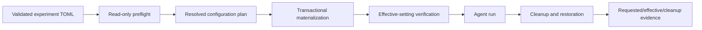

# Configuration Ownership and Lifecycle

**Status:** Proposed
**Date:** 2026-08-23

## Motivation

The legacy `llm-eval` workflow accumulated several ways to configure LM Studio
and several more ways to point each harness at it. Some settings came from
flags, some from environment variables, some from temporary or user-global
files, and some from pre-existing machine state. That made runs harder to
repeat, adapters harder to reason about, and cleanup difficult to verify.

Ralph Bench treats configuration as a first-class conductor responsibility.
`rb` collects one normalized experiment intent. Provider and client adapters
translate only the portions they own into scoped native configuration. The run
bundle records what was requested, what was materialized, and what was actually
observed.

## Design goals

- One declarative source for requested run configuration.
- A common lifecycle across clients and providers.
- No silent inheritance of unrelated global client configuration.
- Explicit ownership of every generated flag, environment value, and file.
- Idempotent setup and cleanup with diagnosable partial failure.
- Requested/effective comparisons instead of assuming a write took effect.
- Enough adapter-specific flexibility without adapter-specific orchestration.
- No credentials in experiment files, logs, workspaces, or bundles.

## Configuration states

Configuration moves through distinct typed states:

1. **Authored experiment** — validated TOML containing user intent and named
   secret references, but no credentials.
2. **Discovered capabilities** — read-only observations used to help author the
   experiment. These are suggestions, not run authority.
3. **Resolved plan** — normalized client, provider, model, controls, budgets,
   and adapter actions after runtime preflight.
4. **Materialized configuration** — exact scoped files, environment keys,
   command arguments, and approved provider mutations used for the run.
5. **Effective configuration** — settings read back from client/provider APIs,
   result streams, and runtime evidence.
6. **Cleanup report** — restoration/removal actions and post-run verification.



The conductor owns the transitions. Adapters return data and bounded actions;
they do not independently orchestrate other adapters.

## Ownership boundaries

### Experiment resolver

The resolver owns the normalized, client-neutral configuration model and:

- Validates cross-field compatibility and required budgets.
- Applies explicit, versioned benchmark defaults.
- Rejects ambiguous or unsupported combinations before mutation.
- Produces a reviewable plan and redacted plan digest.
- Does not write client-native files or call provider mutation APIs.

### Provider adapter

A provider adapter owns provider/runtime behavior, including where supported:

- Endpoint and health discovery.
- Available/loaded model discovery.
- Model load/unload or selection lifecycle.
- Context, quantization, concurrency, GPU/offload, and server settings.
- Provider authentication references and connection metadata.
- Read-back of effective settings and restoration of prior mutable state.

For LM Studio, one adapter—not every client adapter—owns LM Studio probing and
any approved runtime changes. If LM Studio does not expose a reliable API for a
setting, Ralph Bench records that limitation and requires an explicit external
precondition or manual confirmation. It does not pretend the setting was
applied.

### Client adapter

A client adapter owns only its client-native boundary:

- Client executable/version detection.
- Supported provider connection shapes and client controls.
- Rendering a scoped native config, environment overlay, and command line from
  the resolved plan.
- Pointing the client at the provider endpoint/model selected by the provider
  plan.
- Parsing native events and usage evidence.
- Removing scoped client material and verifying that external state was not
  changed.

A client adapter must not configure LM Studio, choose a different model, write
another client's files, or silently fall back to a user-global provider.

### Conductor

The conductor owns:

- Ordering provider and client setup.
- A previewable redacted configuration plan.
- Mutation authorization and rollback registration.
- Ephemeral directories and scoped environment construction.
- Preflight/postflight snapshots and invariant checks.
- Classifying configuration, infrastructure, cleanup, and SUT failures.
- Preserving evidence even when setup or cleanup only partially succeeds.

## Precedence and inheritance

Requested values use this precedence:

1. Explicit experiment TOML.
2. Explicit named profile referenced by the experiment.
3. Versioned challenge/client/provider defaults resolved into the plan.
4. No value; fail or ask during interactive authoring.

User-global client configuration is not an implicit fifth layer. It may be read
during authoring discovery and shown as a proposed choice, but an accepted
choice must become explicit in the experiment or a named profile. A run may
only inherit external configuration through a deliberate, recorded adapter
capability, and such inheritance lowers reproducibility confidence.

When the experiment requests a value that the effective provider/client does
not confirm, the mismatch is evidence. Policy decides whether it is fatal,
ineligible, or merely informational; adapters must not silently relabel the
effective value as requested.

## Transactional run lifecycle

For every run, the conductor performs:

1. Validate the experiment without mutating external state.
2. Detect exact client/provider versions and current health.
3. Resolve a plan and present any material mutation or uncertainty.
4. Snapshot only the external state that an adapter is authorized to touch.
5. Apply provider actions and register compensating restoration actions.
6. Create a fresh scoped home/config and render client configuration there.
7. Read back or smoke-check connectivity without a generation request where
   possible.
8. Execute the client with a minimal explicit environment.
9. Capture requested, materialized, and effective configuration evidence.
10. Remove scoped client state and restore provider state when policy requires.
11. Verify cleanup and record any residual difference.

Cleanup runs after success, failure, cancellation, and timeout. A failed cleanup
does not erase the run; it creates a prominent cleanup/configuration failure
and may make the result ineligible.

## Idempotence

Running the same resolved experiment repeatedly should not accumulate files,
change defaults, select a different provider implicitly, or depend on the
previous run's cleanup succeeding.

Adapters expose stable operations conceptually equivalent to:

```text
detect() -> capabilities and current nonsecret state
plan(request) -> redacted bounded actions
apply(plan, scope) -> materialized state and rollback handle
observe(scope) -> effective nonsecret state
cleanup(handle) -> cleanup report
```

The exact Python interface may evolve, but the lifecycle and ownership must not
collapse into one opaque `configure()` side effect.

## Secret handling

- TOML stores environment-variable or credential-profile names, never values.
- Discovery reports credential availability, never credential contents.
- Only the process that needs a credential receives it.
- Environment overlays start from an allowlist rather than the entire shell.
- Generated native config is kept outside the agent workspace and excluded
  from bundles unless a separately redacted representation is captured.
- Commands, exceptions, and diff evidence pass through structured redaction.
- Cleanup and test fixtures include secret-canary checks.

## Evidence model

Each result bundle records redacted, nonsecret evidence for:

- Authored experiment and canonical hash.
- Client/provider adapter versions and capability results.
- Requested normalized configuration.
- Generated file hashes and redacted semantic content where useful.
- Environment key names and redacted command shape.
- Effective model, endpoint identity, context, inference/runtime settings, and
  relevant client controls where observable.
- Requested/effective mismatches and confidence.
- Setup, restoration, and cleanup outcomes.

Raw user config files and credential stores are never bundled.

## Operator experience

`rb` is the front door to the same model:

- `rb` discovers and authors normalized intent.
- `rb doctor` performs read-only client/provider diagnostics and explains what
  can and cannot be configured or observed.
- `rb run <file>` resolves, previews when interactive policy requires it,
  materializes, executes, and cleans up.

The wizard does not directly edit LM Studio or client configuration. This keeps
authoring safe and allows a generated experiment to be inspected before any
state-changing action.

## P0 tests

- Two different clients targeting the same fake LM Studio provider produce one
  provider plan and separate scoped client configurations.
- Repeated setup/run/cleanup cycles leave identical external fixture state.
- A failed provider apply invokes registered rollback and preserves evidence.
- A timeout/cancellation still invokes cleanup.
- A client cannot write through the provider adapter boundary in contract
  tests.
- User-global fixture settings are not inherited unless explicitly referenced.
- Requested/effective mismatches remain visible and are classified correctly.
- Secret canaries never appear in TOML, rendered config evidence, logs, or
  bundles.
- An unsupported setting fails during planning rather than being ignored.

## P0 estimate

The normalized plan/lifecycle, fake transactional adapters, evidence, and tests
are approximately **3–5 engineering days** and overlap with conductor and
isolation work. Robust LM Studio lifecycle support depends on its documented
runtime APIs and is approximately **2–4 additional days** after a discovery
spike. Each client adapter still needs its own scoped renderer, but does not
reimplement provider orchestration.
