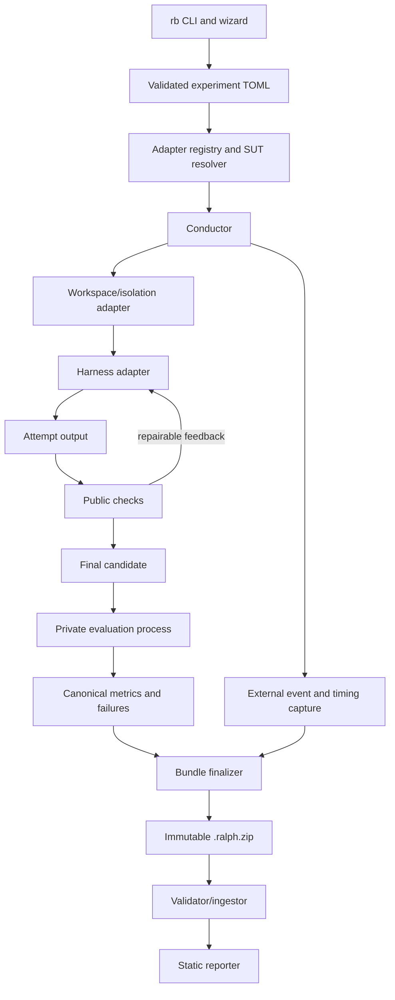

# P0 Skeleton Plan

**Status:** Proposed
**Date:** 2026-08-23
**Target:** One live Codex CLI + ChatGPT + Luna path and deterministic fixtures

## P0 objective

Build a greenfield vertical slice that can run the Busy Intersection and The
5x5 Rush, evaluate a candidate artifact under externally controlled traffic
load, preserve immutable evidence, and generate a skeletal static comparison
site.

The only required live P0 SUT is Codex CLI with ChatGPT-managed OpenAI access
and `gpt-5.6-luna`. Other real harness/provider/model integrations are TBD.
Fake adapters and deterministic artifacts still prove the generic contracts.

P0 is an architectural proof, not the final benchmark release. It must make
the correct contracts difficult to undo later: run identity, attempts,
isolation metadata, challenge boundaries, canonical events, measurements,
bundle immutability, and report separation.

## Definition of done

P0 is complete when all of the following are true:

- The installed command is `rb`; `rb` with no arguments starts a client-first
  interactive experiment wizard in a terminal.
- The wizard safely discovers compatible providers/models where supported,
  degrades to manual entry, and writes a validated TOML specification.
- `rb run` can execute a versioned experiment specification without consulting
  interactive wizard state.
- The conductor produces one normalized configuration plan; provider setup and
  client-native rendering have separate ownership and transactional cleanup.
- Harness, provider, and model implementations are independently registered
  typed adapters composed into a `ResolvedSUT`; compatible additions do not
  require conductor or wizard vendor branches.
- Repetitions receive unique run IDs and never overwrite one another.
- Agent work occurs in a staged workspace outside the source, results,
  references, and private judge-pack directories.
- Every run records an explicit isolation level and metric provenance.
- A fixture harness and generic command harness support deterministic tests.
- Codex CLI with ChatGPT-managed access and `gpt-5.6-luna` can invoke both
  challenge packs and preserve complete evidence whether the artifact passes
  or fails.
- The run records ChatGPT subscription/unmetered cost provenance; per-run USD
  cost is unavailable rather than zero.
- The Busy Intersection and The 5x5 Rush use the same traffic evaluator API.
- The evaluator, not the artifact, supplies the trip demand schedule.
- Every requested trip is accounted for.
- Automated evaluation can advance simulation time deterministically.
- Traffic load rises through held stages until a defined failure boundary.
- The result includes breakdown capacity, peak sustainable throughput,
  ordinary-load delay, queue/spillback evidence, and recovery behavior.
- A controlled repair attempt can receive structured public-check feedback.
- Execution emits a versioned, checksummed `.ralph.zip` bundle.
- `rb bundle validate` rejects malformed, unsafe, incomplete, or tampered
  bundles.
- `rb build` consumes bundles and writes a separate static site without
  modifying source evidence.
- The site exposes the runnable artifact, standardized capture, acceptance
  evidence, performance curve, failures, resource usage, and provenance.
- Unit and integration tests run without a model account or inference server.

## Intended CLI

```bash
rb
rb configure experiments/local-intersection.toml
rb run experiments/local-intersection.toml
rb run experiments/cloud-city.toml
rb bundle validate results/inbox/<run-id>.ralph.zip
rb build --source results/inbox --output site
```

Zero-argument `rb` starts with client selection, then probes the selected
client for providers and models without sending generation requests. It guides
the remaining choices, previews and validates the TOML, saves it atomically,
and offers to run it. Explicit commands remain suitable for unattended use.
See [`CLI_AND_EXPERIMENTS.md`](CLI_AND_EXPERIMENTS.md) for the discovery,
defaulting, security, and reproducibility contract.
See [`CONFIGURATION_MODEL.md`](CONFIGURATION_MODEL.md) for the centralized
provider/client ownership and requested-to-effective lifecycle.
See [`ADAPTER_MODEL.md`](ADAPTER_MODEL.md) for the polymorphic protocols,
registry, capability negotiation, and conformance contracts.

An experiment specification may expand into several runs:

```toml
schema_version = "experiment/v1"
challenge = "busy-intersection/v1"
client = "codex-cli"
model = "gpt-5.6-luna"
provider = "openai-chatgpt"
track = "cloud-subscription"
repetitions = 3

[budget]
max_wall_seconds = 1200
max_attempts = 2

[evaluation]
scenario_pack = "traffic-local-p0"
```

Exact field names remain provisional until schemas are implemented and tested.

## Proposed implementation stack

- Python 3.11+ orchestration with type hints and a standard-library-first core.
- JSON Schema-compatible JSON documents for durable interchange contracts.
- Node.js plus Playwright for browser observation and capture.
- Static HTML/CSS/JavaScript output suitable for GitHub Pages.
- No database requirement in P0; a rebuildable local ingest cache may use
  SQLite from the Python standard library if needed.

## Proposed repository layout

```text
ralph-bench/
├── pyproject.toml
├── ralph_bench/
│   ├── cli.py
│   ├── interactive.py
│   ├── discovery.py
│   ├── configuration.py
│   ├── experiments.py
│   ├── execution.py
│   ├── isolation.py
│   ├── attempts.py
│   ├── events.py
│   ├── metrics.py
│   ├── acceptance.py
│   ├── bundles.py
│   ├── adapters/
│   │   ├── registry.py
│   │   ├── harnesses/
│   │   ├── providers/
│   │   └── models/
│   ├── challenges/
│   └── reporting/
├── browser/
├── challenges/
│   ├── busy-intersection/
│   └── five-by-five-rush/
├── schemas/
├── experiments/
├── tests/
│   ├── fixtures/
│   └── artifacts/
├── docs/
└── site/
```

Private scenario packs, hidden checks, and reference implementations are not
stored in the public repository. P0 may load them from a separately configured
local path.

## Domain terminology

- **Experiment:** A declarative request that expands into one or more runs.
- **Client:** The user-facing agentic coding application. Internally it is
  invoked through a `HarnessAdapter`.
- **SUT:** Model, client/harness, provider/configuration, and effort/tool
  policy.
- **ResolvedSUT:** A versioned composition of one harness, provider, and model
  adapter plus negotiated protocols, capabilities, and normalized options.
- **Run:** One SUT invocation for one challenge repetition. One immutable
  result bundle is produced per run.
- **Attempt:** One agent work interval within a run. A controlled repair loop
  may create more than one attempt.
- **Candidate:** The artifact state produced at the end of an attempt.
- **Scenario:** Evaluator-owned traffic demand, seed, timing, and profile used
  to test the final candidate.
- **Challenge pack:** Public prompt, constraints, starter assets, evaluator API,
  and public checks.
- **Judge pack:** Private scenarios, hidden checks, thresholds, and capture
  instructions.

## Architecture boundary



The agent process must not write authoritative metrics, final bundle metadata,
hidden check results, or reporter output.

## Work packages

### WP0 — Contracts and executable fixtures

**Deliverables**

- Initial schemas for experiment, run manifest, event, assertion, metric,
  failure, and bundle inventory.
- Typed harness/provider/model protocols, adapter descriptors, built-in
  registry, generic model adapter, and capability resolver.
- `rb` console entry point and a terminal-I/O-independent wizard state machine.
- Deterministic TOML rendering, semantic validation, atomic save, and overwrite
  protection.
- Fake client/provider probes covering complete, partial, failed, stale, and
  manual discovery paths.
- Fake harness/provider/model composition matrix and reusable adapter
  conformance suites.
- A fixed clock/ID injection mechanism for deterministic tests.
- Minimal passing, failing, malformed, and adversarial fixture artifacts.
- Terminology encoded consistently in types and filenames.

**Exit criteria**

- Schemas round-trip representative fixtures.
- Wizard output round-trips through the same parser and validator as `rb run`.
- New compatible fake adapters compose without changes to conductor or wizard
  code; duplicate IDs and incompatible contract versions fail at startup.
- Cancellation leaves no partial experiment and no-TTY invocation never hangs.
- Unknown schema versions fail clearly.
- Tests need no browser or provider.

**Estimate:** 6–9 engineering days.

### WP1 — Run identity, conductor, and attempts

**Deliverables**

- Experiment expansion and unique run IDs.
- Run state machine with explicit terminal reasons.
- Attempt directories and controlled feedback lifecycle.
- Independent monotonic wall-clock phase timing.
- Normalized configuration plan, registered rollback actions, and distinct
  requested/materialized/effective/cleanup evidence.
- Process limits and cleanup behavior.

**Exit criteria**

- Repetitions never collide.
- Interrupted runs retain diagnosable partial evidence.
- Failed attempts are preserved rather than overwritten.
- Configuration cleanup executes and is reported after every terminal path.

**Estimate:** 3–5 engineering days.

### WP2 — Staged isolation and harness boundary

**Deliverables**

- Workspace materialization containing only public challenge inputs.
- Ephemeral home/config paths where supported.
- Environment allowlist and redaction.
- Client detection/discovery capability contract with read-only bounded probes.
- Scoped native harness configuration renderer and fake transactional provider
  adapter with strict ownership contract tests.
- Fixture harness and generic command harness.
- Recorded isolation capability/limitations.

**Exit criteria**

- The workspace contains no source repo, prior results, references, or judge
  pack.
- The conductor retains logs outside the agent-writable evidence path.
- P0 isolation is truthfully labeled rather than overstated.

**Estimate:** 4–6 engineering days.

### WP3 — Immutable bundle pipeline

**Deliverables**

- Bundle staging, inventory, redaction, checksums, and deterministic finalization.
- Safe ZIP validation and extraction.
- Completeness and schema checks.
- No report HTML inside the evidence bundle.

**Exit criteria**

- A one-byte mutation fails checksum validation.
- Path traversal, duplicate entries, symlinks, and decompression limits are
  tested.
- Rebuilding a site does not change a source bundle.

**Estimate:** 3–5 engineering days.

### WP4 — Common browser and traffic protocol

**Deliverables**

- Pinned browser runtime and challenge dependency strategy.
- `traffic/v1` interface and event contract.
- Deterministic `advance()` evaluation mode and normal visual playback mode.
- Independent cross-checks for trip accounting, position, overlap, road/lane
  membership, and progress.
- Standard screenshot and WebM capture paths.

**Exit criteria**

- Fixture artifacts prove pass, failure, and dishonest/inconsistent telemetry
  paths.
- Fast-forward evaluation and visible playback use the same simulation state.

**Estimate:** 4–7 engineering days.

### WP5 — Busy Intersection vertical slice

**Deliverables**

- Public challenge pack and prompt.
- Technology-neutral visual brief allowing a polished 2D, 2.5D, or 3D
  intersection presentation.
- Private P0 scenarios and thresholds.
- Topology, signal, movement, pedestrian, safety, fairness, and queue checks.
- One standardized visual capture.
- Public structured feedback suitable for one controlled repair.

**Exit criteria**

- Passing and deliberately broken fixtures produce specific evidence.
- Several seeds yield deterministic results.
- The full run-to-bundle-to-site path works without the city challenge.

**Estimate:** 5–8 engineering days.

### WP6 — Adaptive load-to-failure engine

**Deliverables**

- Warm-up, held load stages, peak, cooldown, and recovery phases.
- Last-sustainable/first-failing bracket.
- Optional refinement runs inside the bracket.
- Transport and runtime failure classification.
- Capacity curve, normal-load quality, and recovery metrics.

**Exit criteria**

- Offered, admitted, active, completed, and backlogged trips reconcile.
- Temporary queues do not falsely count as immediate breakdown.
- Failure and recovery are reproducible for a fixed seed/profile.

**Estimate:** 4–6 engineering days.

### WP7 — The 5x5 Rush generalization

**Deliverables**

- Public frontier challenge pack.
- Grand visual brief covering city-scale composition, spatial legibility,
  information design, atmosphere, and creative latitude.
- Grid, freeway, crossing, interchange, ramp, and OD-route validation.
- Balanced, inbound, and outbound P0 demand profiles.
- Ramp spillback, blocked-intersection, freeway collapse, fairness, and recovery
  checks.
- Overview and interchange captures.

**Exit criteria**

- The city evaluator is implemented as challenge logic over shared traffic
  contracts, not as special cases in the conductor.
- At least one fixture reaches a valid sustainable capacity and one fails via
  each critical spillback class.

**Estimate:** 6–10 engineering days.

### WP8 — Skeletal ingest and static reporting

**Deliverables**

- Bundle discovery, validation, quarantine, and ingest.
- Local/cloud top-level separation.
- Run detail page with artifact, capture, assertions, failures, metrics,
  throughput curve, attempts, provenance, and human visual-review prompts.
- Combination aggregation with repetitions and sample counts.
- Performance-versus-resource Pareto chart.

**Exit criteria**

- Invalid bundles never silently enter official views.
- Missing and estimated metrics remain visibly labeled.
- Reports are deterministic for the same bundle set.

**Estimate:** 4–7 engineering days.

### WP9 — Codex CLI + ChatGPT + Luna live path

**Deliverables**

- Codex CLI harness adapter with pinned version detection and read-only
  `codex login status` preflight.
- ChatGPT-managed OpenAI provider adapter representing authentication,
  entitlement, service, and subscription/unmetered billing provenance.
- `gpt-5.6-luna` model descriptor with explicit configurable reasoning effort.
- Client-first wizard path that detects Codex, verifies authentication method,
  offers the supported Luna model, and explains how to run `codex login` when
  needed without handling credentials itself.
- Non-interactive `codex exec` invocation with JSONL, ephemeral session state,
  explicit model/sandbox, and isolated or ignored user configuration.
- Preserved raw stdout JSONL and stderr plus normalized events, token usage,
  tool activity, turn outcome, and canonical external timing.
- End-to-end live attempts for both challenge tiers, regardless of pass/fail.
- Fixture-only coverage for metered cost, mutable providers, unknown models,
  and additional compatible adapter compositions.

**Exit criteria**

- One Codex/ChatGPT/Luna bundle for each challenge validates and renders; a
  model failure remains a valid integration result when evidence is complete.
- Zero-argument `rb` can author, validate, save, and launch the live SUT without
  exposing credentials or inheriting unrelated Codex configuration.
- Provider-reported and evaluator-derived metrics have explicit provenance.
- Cost is classified `subscription_unmetered` with USD unavailable.
- Repeating the smoke experiment does not accumulate session/config state or
  depend on user model defaults.

**Estimate:** 3–5 engineering days plus live model run time.

### WP10 — Hardening and approval evidence

**Deliverables**

- Full unit/integration/end-to-end test pass.
- Threat-model and failure-injection results.
- P0 sample site.
- Known limitations and P1 backlog.
- Pilot threshold recommendations based on observed artifacts.

**Estimate:** 3–5 engineering days plus model run time.

## Sequencing

```text
WP0 -> WP1 -> WP2 -> WP3
                 \-> WP4 -> WP5 -> WP6 -> WP7
WP3 + WP5 + WP6 -------> WP8
WP1 + WP2 + WP4 -------> WP9
all --------------------> WP10
```

The recommended implementation checkpoints are:

1. **P0-A infrastructure:** WP0–WP4.
2. **P0-A vertical slice:** WP5–WP6 plus minimal WP8.
3. **P0-B generalization:** WP7.
4. **Real-system proof:** WP9.
5. **P0 release candidate:** complete WP8 and WP10.

## Test strategy

### Unit tests

- Prompt-state transitions, back/edit/cancel, and intelligent default
  precedence.
- Configuration-plan precedence, provider/harness ownership, rollback,
  requested/effective mismatch, and idempotent repeated setup/cleanup.
- Registry/descriptor validation, capability negotiation, adapter composition,
  generic-model fallback, and shared conformance suites.
- Client/provider/model discovery success, timeout, stale result, and manual
  fallback.
- TOML rendering, round-trip validation, atomic save, and overwrite behavior.
- TTY versus non-TTY command behavior and secret-redaction snapshots.
- Schema and version handling.
- Experiment expansion and IDs.
- Run/attempt state transitions.
- Event normalization and timing.
- Metric calculations and failure thresholds.
- Checksum and ZIP validation.
- Redaction and path validation.

### Fixture artifact tests

- Clean passing intersection.
- Collision, red-light, starvation, trip-loss, queue, and deadlock failures.
- Clean passing city.
- On-ramp spillback, off-ramp spillback, disconnected graph, invalid route,
  blocked grid, and non-recovery failures.
- Artifact that reports dishonest counters inconsistent with vehicle state.

### Integration tests

- Fixture harness through bundle finalization.
- Public check feedback through a second controlled attempt.
- Browser evaluator through deterministic fast-forward and capture.
- Bundle ingest through static page generation.

### End-to-end smoke tests

- Codex CLI + ChatGPT-managed access + `gpt-5.6-luna` invokes Busy
  Intersection and The 5x5 Rush and produces complete bundles whether the model
  succeeds or fails.
- At least two repetitions of one live experiment prove no overwrite and valid
  aggregation.

## P0 non-goals

- Google Drive or other remote artifact stores.
- Strong OS-level sandbox support on every platform.
- Every harness from the legacy benchmark.
- Any additional real harness/provider/model composition, including OpenCode,
  LM Studio, local models, and API-key-metered OpenAI.
- Universal provider/model discovery for every client; adapters may expose
  partial capability and manual entry honestly.
- Arbitrary third-party adapter loading or a complete model catalog.
- A legacy corpus importer.
- A frontier-model qualitative judge.
- A polished public design system.
- A universal composite overall score.
- City pedestrians, parking, incidents, emergency vehicles, or road closures.
- Energy measurement or infrastructure-normalized throughput.

## Primary risks and mitigations

| Risk | P0 mitigation |
|---|---|
| Agent fabricates telemetry | Cross-check trip IDs, visible/entity position, network membership, and event reconciliation; label the remaining trust boundary. |
| Thresholds encode arbitrary preferences | Keep thresholds in versioned judge packs and calibrate using fixtures and pilot runs. |
| Fast-forward diverges from visible behavior | Require one state/update path and test fast-forward state against normal playback. |
| Cross-platform isolation is inconsistent | Record capabilities and isolation level; exclude unsealed results from official views. |
| Vendor metrics are missing or incomparable | Measure wall phases independently and attach provenance/confidence to every vendor metric. |
| City task overwhelms core development | Finish the intersection vertical slice before implementing city-specific checks. |
| Public repository leaks hidden material | Keep judge packs and reference implementations outside the public repository. |
| Optimization rewards unrealistic roads | Fix physics and infrastructure envelopes in versioned challenge definitions. |
| A client cannot enumerate providers/models reliably | Use capability-labeled layered probes with timeouts, show provenance/freshness, and preserve manual entry. |
| Wizard convenience undermines reproducibility | Make validated TOML the execution boundary; never consult remembered wizard state during explicit runs. |
| Discovery leaks credentials or incurs cloud cost | Permit only read-only, non-generation probes; redact diagnostics and store credential references rather than values. |
| Harness adapters reintroduce incompatible provider setup | Enforce typed ownership: provider adapters configure providers once; harness adapters receive a resolved connection plan and write only scoped client state. |
| Adapter support grows into a harness-provider-model cross-product | Register the three axes independently, negotiate typed capabilities, and require new compatible adapters to pass composition tests without core changes. |
| ChatGPT authentication is valid but Luna is unavailable to the account | Probe auth method and effective model at runtime, classify entitlement/availability separately, and never infer access from login alone. |
| The Codex agent tool shell can read ChatGPT credentials | Require a tested credential-store boundary and canary probe; otherwise label the live smoke L0/unsealed and ineligible. |
| Codex CLI flags or JSONL events change | Pin and record the tested CLI version, preserve raw output, and maintain fixture-backed parser contracts. |
| Subscription usage is mistaken for zero-cost work | Classify it as unmetered with USD unavailable and exclude it from metered-cost ranking. |

## Estimated effort

The P0-A intersection vertical slice, including the guided `rb` authoring path,
is expected to require roughly four to five full-time engineering weeks. P0-B
city generalization and complete reporting add roughly two to four weeks. A
realistic P0 range is **six to nine engineering weeks**, excluding elapsed
model execution and calibration time.

## Approval checklist

Before implementation begins, approve or amend these proposed choices:

- [ ] Python conductor with Node/Playwright browser worker.
- [ ] `rb` as the installed command, with a client-first zero-argument wizard
      and deterministic explicit commands.
- [ ] Validated TOML as the boundary between interactive authoring and run
      execution; read-only layered discovery with manual fallback.
- [ ] Centralized transactional configuration lifecycle with provider/harness
      ownership, effective-setting evidence, and verified cleanup.
- [ ] Independent polymorphic harness/provider/model adapter families, a
      built-in registry, capability resolver, and conformance suites.
- [ ] Immutable `.ralph.zip` bundle per run.
- [ ] Separate public challenge packs and private judge packs.
- [ ] Staged isolation in P0 with stronger OS sandboxes deferred.
- [ ] Codex CLI + ChatGPT-managed OpenAI access + `gpt-5.6-luna` as the only
      required live P0 SUT; reasoning effort remains experiment-configurable.
- [ ] OpenCode, LM Studio, local models, API-key-metered OpenAI, and all other
      real integrations deferred as TBD.
- [ ] Busy Intersection completed before city-specific evaluator work.
- [ ] No single composite overall score in P0.
- [ ] Google Drive, qualitative model judging, and legacy import deferred.
