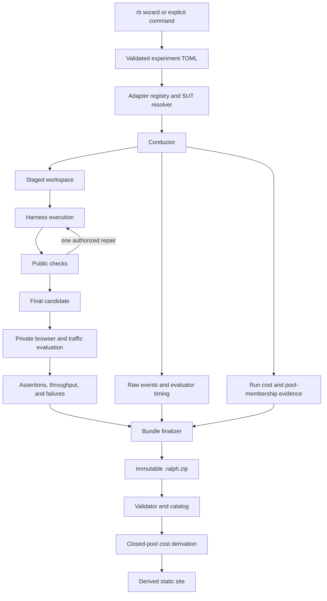

# P0 Skeleton Plan

**Status:** Proposed
**Date:** 2026-08-23
**P0-A target:** One complete Busy Intersection vertical slice through every
durable system boundary

## Objective

Build the smallest Ralph Bench that is already shaped like the intended
product: guided experiment authoring, polymorphic SUT resolution, controlled
execution, staged isolation, deterministic browser evaluation, immutable
evidence, mandatory cloud cost, and a visually coherent derived report.

The abstractions are not speculative. The legacy evaluator already proves the
need for separate harness/provider/model behavior, normalized metrics and
events, provider lifecycle ownership, unique run identity, immutable evidence,
and report-time aggregation. P0 narrows the number of concrete implementations
without removing those known seams.

The only required live P0-A SUT is:

```text
Harness:  Codex CLI
Provider: ChatGPT-managed OpenAI access
Model:    gpt-5.6-luna
Track:    cloud-subscription
```

The only complete P0-A challenge evaluator is Busy Intersection. The 5x5 Rush
remains a versioned challenge contract and fixture in P0-A, then becomes the
P0-B generalization milestone.

## Skeleton rule: preserve the seam, implement one path

Every extension seam justified by prior experience remains typed and tested.
P0-A gives it one real implementation plus fakes or fixtures rather than
several production variants.

| Seam | Durable contract built now | One P0-A implementation | Deferred breadth |
|---|---|---|---|
| SUT composition | Typed harness, provider, and model adapters; registry; capability resolution | Codex + ChatGPT + Luna | Other live clients, providers, models, and third-party loading |
| Configuration | Requested/materialized/effective/cleanup lifecycle and ownership | Read-only ChatGPT entitlement plus scoped Codex invocation | Mutable LM Studio lifecycle and other native renderers |
| Agent loop | Preserved attempts and structured feedback boundary | Evaluator-controlled loop, at most two attempts | Native-loop comparison and alternate repair strategies |
| Isolation | Versioned capability/taint report and conductor-owned evidence | One L1 staged-workspace implementation | L2/L3 containers, provider proxying, universal network control |
| Storage | Immutable bundle/store boundary | Local `.ralph.zip` inbox | Google Drive and other remote stores |
| Browser | Versioned browser observation/capture boundary | One pinned Chromium/Playwright worker | Other browsers, capture backends, and viewpoints |
| Challenge | Versioned challenge plug-in boundary and shared `traffic/v1` | Busy Intersection | Live 5x5 Rush evaluator and other challenge families |
| Load search | Evaluator-owned demand, held stages, failure and recovery semantics | One bounded deterministic stage schedule, no bracket refinement | Multiple production profiles and adaptive refinement |
| Cost | Typed cost vector, policy, provenance, and completeness | Flat ChatGPT subscription attempt-pool allocation | Live API billing, invoice imports, token/quota normalization |
| Reporting | Read-only bundle view model | One polished index and one run-detail page | Rich explorer, full Pareto interaction, alternate themes |
| Media | Standard capture record tied to artifact hash | One animated overview plus poster | Multi-angle and side-by-side synchronized playback |

Fakes are not substitute production integrations. They are conformance tools
that prove the conductor, wizard, and reporter depend on contracts rather than
vendor-name branches.

See [ADR 0009](adr/0009-one-real-implementation-per-p0-seam.md).

## P0-A definition of done

P0-A is complete when all of the following are true:

- The installed command is `rb`; zero arguments in a TTY start a client-first
  guided experiment wizard.
- The wizard and `rb run` share one versioned TOML parser and semantic
  validator. An explicit run never consults wizard history.
- Harness, provider, and model adapters compose into a `ResolvedSUT`; adding a
  compatible fake adapter requires no conductor or wizard branch.
- The real wizard path detects Codex, checks ChatGPT authentication read-only,
  offers Luna, and requires a valid subscription cost policy.
- Every repetition and attempt has a unique identity and is never overwritten.
- A controlled public-check loop permits at most one repair attempt and
  preserves both candidates and their resource use.
- The agent receives a fresh staged workspace containing only public inputs;
  isolation limits and canary results are recorded honestly.
- A Codex + ChatGPT + Luna run invokes Busy Intersection and preserves complete
  evidence whether the model passes or fails.
- Cloud cost evidence records pool membership and chargeable attempts; once all
  expected bundles are present, the derived catalog contains non-null allocated
  subscription USD. Raw usage/provenance remains separate, and missing cost is
  never zero. An experiment with no chargeable model invocation remains
  diagnostic and cost-incomplete.
- Busy Intersection exposes `traffic/v1`; evaluator-driven stepping and visible
  playback use the same simulation state.
- Evaluator-owned demand rises through held stages until the first sustained
  failure, then stops for cooldown/recovery.
- Requested, admitted, active, completed, rejected, backlogged, and lost trips
  reconcile.
- Results include the last sustainable offered load, peak valid throughput,
  ordinary-load delay, first failure, queue evidence, and recovery outcome.
- The evaluator produces one standardized animated overview and poster image
  tied to the evaluated artifact hash.
- Execution finalizes one versioned, redacted, checksummed `.ralph.zip` bundle
  per run; `rb bundle validate` rejects malformed, unsafe, incomplete, or
  tampered input.
- `rb build` reads validated bundles from a local inbox and writes a separate,
  deterministic static site with a coherent visual system.
- The site separates local and cloud cohorts and clearly presents acceptance,
  traffic performance, cost/time, attempts, failures, artifact/capture, and
  provenance.
- A versioned 5x5 Rush descriptor and topology fixture traverse the same
  challenge boundary without city branches in the conductor.
- Unit and fixture integration tests run without a model account, inference
  server, or private judge pack.

Passing the traffic challenge is not required to prove the live integration;
a complete, diagnosable model failure is a valid smoke result. Deterministic
fixture artifacts are authoritative for evaluator acceptance tests.

## P0-B definition

P0-B implements The 5x5 Rush over the P0-A seams:

- Public city challenge pack and private P0-B profiles.
- Grid/freeway topology, complete ramp connectivity, OD routing, merging, and
  signal-network validation.
- Ramp spillback, grid blockage, freeway collapse, fairness, and recovery
  checks.
- Overview and interchange captures.
- The same live Codex + ChatGPT + Luna SUT applied to one city run, whether
  passing or failing.

P0-B succeeds only if this work plugs into the challenge, browser, metrics,
bundle, cost, and reporting contracts without adding city-specific branches to
the conductor.

## Intended CLI

```bash
rb
rb configure experiments/cloud-intersection.toml
rb run experiments/cloud-intersection.toml
rb bundle validate results/inbox/<run-id>.ralph.zip
rb build --source results/inbox --output site
```

Zero-argument `rb` starts with client selection, then uses bounded, read-only
adapter probes for compatible providers and models. It previews and validates
the TOML, saves atomically, and may offer to run it. Explicit commands remain
suitable for unattended use.

An illustrative P0-A experiment is:

```toml
schema_version = "experiment/v1"
name = "codex-chatgpt-luna-intersection"
challenge = "busy-intersection/v1"
client = "codex-cli"
provider = "openai-chatgpt"
model = "gpt-5.6-luna"
track = "cloud-subscription"
repetitions = 3

[client_options]
reasoning_effort = "high"
loop = "controlled"

[budget]
max_wall_seconds = 1200
max_attempts = 2

[evaluation]
scenario_pack = "traffic-intersection-p0a"

[cost]
policy = "flat-subscription-attempt-pool/v1"
pool_id = "chatgpt-luna-intersection-pilot-01"
pool_scope = "experiment"
currency = "USD"
service_plan = "chatgpt-plus"
billing_period_cost_usd = "20.00"
benchmark_allocation_fraction = "1.0"
pool_cost_usd = "20.00"
pool_cost_source = "operator_attested_period_charge"
allocation_rationale = "dedicated_benchmark_period"
billing_period_start = "2026-08-01"
billing_period_end = "2026-08-31"
closure = "all_expected_runs_terminal"

[output]
inbox = "results/inbox"
```

Financial values are examples, not inferred defaults. The operator supplies
and confirms the actual plan/accounting inputs. Exact field names remain
provisional until fixtures exercise the schemas.

See:

- [`CLI_AND_EXPERIMENTS.md`](CLI_AND_EXPERIMENTS.md)
- [`CONFIGURATION_MODEL.md`](CONFIGURATION_MODEL.md)
- [`ADAPTER_MODEL.md`](ADAPTER_MODEL.md)
- [`COST_MODEL.md`](COST_MODEL.md)

## Architecture boundary



The agent process never owns authoritative timing, private checks, traffic
metrics, cost allocation, bundle identity/checksums, or reporter output.

## Proposed implementation stack

- Python 3.11+ typed orchestration with a standard-library-first core.
- Versioned JSON/TOML boundary documents; typed internal objects need not each
  become public JSON Schemas.
- Node.js plus one lockfile-pinned Playwright package/browser revision for
  observation/capture; record the executable digest and downgrade a mismatched
  runtime to experimental rather than silently treating it as canonical.
- Static HTML/CSS/JavaScript output suitable for GitHub Pages.
- No database requirement; the bundle catalog is rebuildable.

## Boundary schemas in P0-A

P0-A versions only durable interchange boundaries:

- `experiment/v1`
- run/bundle manifest and inventory
- canonical event envelope
- assertion, metric, failure, and cost envelopes
- `traffic/v1` bridge payloads needed by Busy Intersection

Challenge-private implementation objects, wizard screens, internal state
transitions, and every vendor payload do not each receive a public schema.
Vendor streams are retained raw and normalized at their adapter boundary.

## Work packages and estimates

### WP0 — Contract spine, registry, and guided authoring

Build boundary types/schemas, typed adapter families, built-in registry,
capability resolution, deterministic IDs/clocks, fake composition tests, the
terminal-I/O-independent wizard state machine, and deterministic TOML
round-tripping.

**Exit:** a compatible fake adapter composes without core changes; invalid
versions/combinations fail clearly; cancel/no-TTY paths do not leave partial
files or hang.

**Estimate:** 4–5 engineering days.

### WP1 — Conductor, attempts, configuration, and staged isolation

Build the run state machine, unique repetitions, at most two preserved
attempts, phase timing, configuration ownership/cleanup, process termination,
one L1 staged-workspace implementation, redaction, and canary evidence.

**Exit:** failure, timeout, and cancellation preserve evidence and execute
cleanup; fixture agents cannot reach source, prior results, judge material, or
conductor-owned evidence through the supported staged paths.

**Estimate:** 5–7 engineering days.

### WP2 — Minimal immutable bundle and validator

Build a P0 bundle profile containing manifests, prompt, raw/canonical events,
attempts, selected artifact, assertions/metrics/failures/cost evidence, one
capture pair, consolidated provenance, inventory, and checksums. Implement
atomic finalization and safe validation/extraction into a local inbox.

**Exit:** mutation, traversal, duplicate/case collision, symlink, partial ZIP,
size-limit, checksum, and missing-reference fixtures are rejected; site builds
never mutate bundles.

**Estimate:** 2–3 engineering days.

### WP3 — Common browser, traffic bridge, and capture

Build one pinned Chromium/Playwright worker, the Busy Intersection portion of
`traffic/v1`, deterministic `advance()`, snapshot/event validation, runtime
classification, one WebM overview, and one PNG poster.

**Exit:** visible playback and fast-forward reach equivalent state for a fixed
seed; malformed bridge responses, browser crashes, fabricated counters, and
incomplete event drains are detected. Capture metadata identifies the artifact,
scenario/seed, interval, viewport, frame rate, and exact browser worker.

**Estimate:** 4–5 engineering days.

### WP4 — Busy Intersection and bounded load-to-failure

Build the public challenge, technology-neutral visual brief, one canonical
demand profile across a small fixed seed set, safety/accounting/fairness/queue
checks, bounded held load stages, first-failure classification, cooldown, and
recovery. Do not implement optional bracket refinement in P0-A.

**Exit:** passing and deliberately broken fixtures produce reproducible
throughput, delay, collision/violation, backlog, starvation, breakdown, and
recovery evidence. The calibrated profile/seed manifest is versioned and
recorded with every result.

**Estimate:** 6–8 engineering days.

### WP5 — Skeletal static product

Build deterministic local/cloud navigation, one comparison index, one run
detail view, artifact download, animated preview/poster, acceptance and
failure evidence, throughput curve, a compact static throughput/resource
scatter, cost/time/token cards, attempts, and provenance. The static report
never executes untrusted candidate HTML/JavaScript; running the downloaded
self-contained artifact is an explicit action outside the report shell. Use a
small coherent visual system rather than unrelated report fragments.

**Exit:** invalid bundles never enter normal views; the same bundle set and
closed cost pool produce the same site; malicious candidate markup is escaped
and never executed by the report shell.

**Estimate:** 3–4 engineering days.

### WP6 — Codex, ChatGPT, Luna, and subscription cost

Build Codex detection/version/auth fixtures, explicit non-interactive Luna
invocation with JSONL evidence and ephemeral/scoped configuration, event/usage
normalization, the ChatGPT provider adapter, Luna descriptor, and
`flat-subscription-attempt-pool/v1`.

**Exit:** the wizard authors and launches the live path without exposing
credentials; a Busy Intersection run validates and renders; a closed pool
produces allocated USD cost including all attempts and failures.

**Estimate:** 3–4 engineering days plus live model time.

### WP7 — Hardening and milestone evidence

Run fixture, integration, threat/failure-injection, and live smoke tests;
publish a sample site, known limitations, threshold notes, and P0-B backlog.

**Estimate:** 3–4 engineering days plus model/calibration time.

### Estimate summary

P0-A represents approximately **30–40 engineering days** of work. The packages
overlap and can be developed by bounded subagents, but integration, browser
calibration, live-run diagnosis, and lead review remain serial constraints. A
realistic target is **four to six calendar weeks** with one lead plus two or
three productive implementation streams and active review; a mostly serial
effort is more safely **six to eight calendar weeks**.

P0-B city generalization is approximately **8–12 additional engineering days**
or roughly **two to three calendar weeks**, depending on evaluator and visual
calibration. It is estimated separately so the first usable skeleton is not
held hostage by the larger challenge.

## Sequencing

```text
WP0 -> WP1 -> WP2
          \-> WP3 -> WP4
WP2 + WP4 -------> WP5
WP0 + WP1 -------> WP6
all -------------> WP7
P0-A ------------> P0-B city generalization
```

Fixture adapters and artifacts come before paid live inference. Browser,
bundle, reporting, and Codex work can proceed in parallel after their boundary
fixtures are stable.

## Contract and end-to-end tests

The skeleton is protected by tests that cross its seams:

- Fixture harness -> public feedback -> final candidate -> private evaluation
  -> bundle -> validation -> static site.
- Candidate artifact, evaluator evidence, and capture all reference the same
  tree hash.
- A second compatible fake harness/provider/model composes without changes to
  conductor, wizard, bundle, or reporter code.
- Requested/materialized/effective configuration and cleanup remain distinct;
  cleanup runs on every terminal path.
- Repetitions and attempts never collide or overwrite earlier evidence.
- Demand reconciliation catches dropped, duplicated, shortened, teleported,
  or fabricated trips.
- Held stages distinguish transient queues from sustained breakdown and record
  recovery.
- Missing cost stays null/incomplete; closed-pool allocation includes repair
  attempts and failures and reconciles to the declared pool cost.
- Conductor-owned `model_invocation.started` evidence charges ambiguous
  post-spawn failures conservatively; incomplete member evidence prevents pool
  closure.
- Pool-cost source/allocation provenance produces a mechanical comparability
  key; incompatible pools never share a primary-cost ranking.
- The same input bundles generate byte-stable content except for explicitly
  declared build metadata.
- Invalid bundles are quarantined and duplicate run IDs are diagnosed.
- A malicious candidate fixture containing script, navigation, and exfiltration
  attempts is offered only as inert/downloadable content and never executes in
  the report shell.
- A city topology fixture uses the challenge registry and `traffic/v1` without
  a conductor special case.

## P0-A non-goals

- A complete live 5x5 Rush evaluator or city model run; those are P0-B.
- Any second live harness, provider, model family, or local inference runtime.
- Universal provider/model discovery or a complete model catalog.
- Arbitrary third-party adapter loading.
- More than one production traffic profile, adaptive bracket refinement, or a
  large calibration matrix.
- Multiple browsers, multiple capture viewpoints, or synchronized side-by-side
  playback.
- Google Drive or any remote artifact store.
- L2/L3 OS isolation, provider proxying, or universal network enforcement.
- Provider billing APIs, invoices, multi-currency accounting, or live metered
  API integration.
- Published per-token cost breakdowns and percentage of daily/weekly/rolling
  quota consumed across plans; this is a post-P0 stretch goal.
- Frontier-model qualitative judging.
- Legacy corpus import or migration of every prior runner.
- A single composite overall score.

## Primary risks and mitigations

| Risk | P0-A mitigation |
|---|---|
| Known abstractions become over-engineered | Version only durable boundaries; require one real implementation and contract fixtures, not production breadth. |
| The first implementation accidentally defines vendor-shaped core APIs | Fake composition tests and a city fixture must cross the same seams without conductor branches. |
| Subscription allocation is mistaken for a provider bill | Show allocated, marginal, credit, and list-price-equivalent values separately with policy/provenance. |
| Personal subscription use makes allocation arbitrary | Require billing-period/source/fraction provenance for the explicit experiment pool amount and cohort only matching comparability keys. |
| Agent fabricates traffic telemetry | Reconcile evaluator-issued trips, snapshots, events, geometry, and browser observations. |
| Fast-forward diverges from visible behavior | Require one simulation state/update path and equivalence fixtures. |
| L1 isolation is overstated | Publish capability/canary evidence; label the live result L0/unsealed if credential or filesystem boundaries cannot be demonstrated. |
| Visual polish gets deferred as “just reporting” | Require one coherent site shell and one animated artifact preview in the P0-A exit criteria. |
| City work destabilizes the core | Finish/freeze P0-A contracts, then require P0-B to plug in without city branches. |
| Vendor CLI/events change | Pin and record the tested Codex version, preserve raw streams, and maintain parser fixtures. |

## Approval checklist

- [ ] Evidence-backed harness/provider/model, configuration, bundle, challenge,
      cost, and reporting seams remain in P0-A.
- [ ] Each seam receives one real implementation plus fakes/fixtures.
- [ ] Codex CLI + ChatGPT-managed access + Luna is the only required live SUT.
- [ ] Busy Intersection is the only complete P0-A evaluator.
- [ ] The 5x5 Rush contract/fixture is P0-A; full city implementation is P0-B.
- [ ] Cloud cost is mandatory; P0 uses flat subscription attempt-pool allocation.
- [ ] One controlled repair attempt, one L1 staged implementation, one browser,
      one animated capture, one local inbox, and one small static site define the
      concrete P0-A breadth.
- [ ] Google Drive, quota-burden reporting, frontier judging, other live SUTs,
      and richer comparison UX remain post-P0-A.
