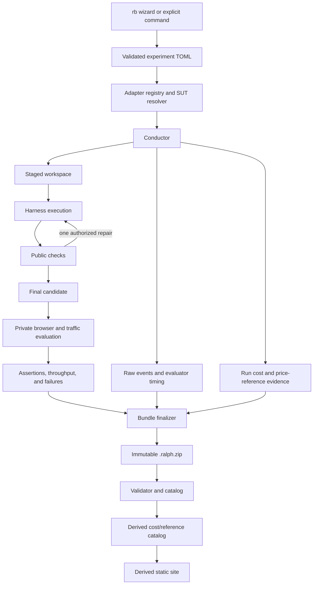

# P0 Skeleton Plan

**Status:** Accepted, as amended by [ADR 0011](adr/0011-cloud-cost-evidence-and-openrouter-references.md) and [ADR 0014](adr/0014-seam-first-evaluation-and-active-harness.md)
**Date:** 2026-08-23
**P0-A target:** A seam-complete Busy Intersection vertical slice through every
durable system boundary, with the Challenge Portability Fixture proving that
future challenges can extend the system without Busy-specific orchestration.

## Objective

Build the smallest Ralph Bench that is already shaped like the intended
product: guided experiment authoring, polymorphic SUT resolution, controlled
execution, staged isolation, deterministic browser evaluation, immutable
evidence, honest cloud-cost provenance, and a visually coherent derived report.

The abstractions are not speculative. The legacy evaluator already proves the
need for separate harness/provider/model behavior, normalized metrics and
events, provider lifecycle ownership, unique run identity, immutable evidence,
and report-time aggregation. P0 narrows the number of concrete implementations
without removing those known seams.

The initial live P0-A SUT is:

```text
Harness:  Codex CLI
Provider: ChatGPT-managed OpenAI access
Model:    gpt-5.6-luna
Track:    cloud-subscription
```

The only complete P0-A challenge evaluator is Busy Intersection. The former
“5x5 Rush descriptor/topology fixture” is now the **Challenge Portability
Fixture**: a small second-challenge adapter proof, not a partial city
implementation. The complete future-city evaluator remains open and is not a
P0-A requirement.

The next additional real SUT is Pi-wiggum with a local model. It is introduced
only after the common harness, provider, model, challenge, evaluation, and
lifecycle seams are complete. The current Codex path remains a supported
compatibility path and resolves the most recent available Codex release at run
time.

## Skeleton rule: preserve the seam, implement one path

Every extension seam justified by prior experience remains typed and tested.
P0-A gives it one real implementation plus fakes or fixtures rather than
several production variants.

| Seam | Durable contract built now | One P0-A implementation | Deferred breadth |
|---|---|---|---|
| SUT composition | Typed harness, provider, and model adapters; registry; capability resolution; current-version harness preflight | Codex + ChatGPT + Luna; Pi-wiggum + local model as the next proving path | Other live clients, providers, models, and third-party loading |
| Configuration | Requested/materialized/effective/cleanup lifecycle and ownership | Read-only ChatGPT entitlement plus scoped Codex invocation | Mutable LM Studio lifecycle and other native renderers |
| Agent loop | Preserved attempts and structured feedback boundary | Evaluator-controlled loop, at most two attempts | Native-loop comparison and alternate repair strategies |
| Isolation | Versioned capability/taint report and conductor-owned evidence | Portable L0 staged-workspace protection with explicit limitations | Selection and implementation of OS/container/VM-backed L1/L2 protection |
| Storage | Immutable bundle/store boundary | Local `.ralph.zip` inbox | Google Drive and other remote stores |
| Browser | Versioned browser observation/capture boundary | One pinned Chromium/Playwright worker | Other browsers, capture backends, and viewpoints |
| Challenge | Versioned challenge plug-in boundary and challenge-owned monitoring protocols | Busy Intersection plus the Challenge Portability Fixture | Future city evaluator and other challenge families |
| Load search | Evaluator-owned demand, held stages, failure and recovery semantics | One bounded deterministic stage schedule, no bracket refinement | Multiple production profiles and adaptive refinement |
| Cost | Typed cost vector, billing/reference provenance, and completeness | P0-A subscription result with cost unavailable plus time/token/attempt evidence | OpenRouter billing/reference implementation, subscription allocation, invoices, token/quota normalization |
| Reporting | Read-only bundle view model | One polished index and one run-detail page, after seam completion | Rich explorer, full Pareto interaction, alternate themes |
| Media | Standard capture record tied to artifact hash | One animated overview plus poster | Multi-angle and side-by-side synchronized playback |

Fakes are not substitute production integrations. They are conformance tools
that prove the conductor, wizard, and reporter depend on contracts rather than
vendor-name branches.

See [ADR 0009](adr/0009-one-real-implementation-per-p0-seam.md).

## P0-A definition of done

P0-A is complete when all of the following are true:

- The installed command is `rb`; zero arguments in a TTY start a client-first
  guided experiment wizard.
- The wizard and `rb run` share one versioned TOML parser and semantic
  validator. An explicit run never consults wizard history.
- Harness, provider, and model adapters compose into a `ResolvedSUT`; adding a
  compatible fake adapter requires no conductor or wizard branch.
- The real wizard path discovers the current Codex release, checks ChatGPT
  authentication read-only, and offers Luna. It does not ask for a subscription
  allocation or cost questionnaire.
- Every repetition and attempt has a unique identity and is never overwritten.
- A controlled acceptance loop permits at most one repair attempt, gives the
  model public conformance and browser/runtime diagnostics without prescribing
  a solution, and preserves both candidates and their resource use.
- Functional eligibility is a prerequisite for performance comparison. A
  working artifact receives independent throughput, capacity, latency, backlog,
  and recovery measurements; P0 does not combine them into one score.
- The agent receives a fresh staged workspace containing only public inputs;
  isolation limits and canary results are recorded honestly.
- A Codex + ChatGPT + Luna run invokes Busy Intersection and preserves complete
  evidence whether the model passes or fails.
- A pre-evaluation failure with no candidate or no started evaluator fails fast
  without producing a result bundle. A preserved candidate that reaches
  evaluation produces a bundle even when its result is failed.
- Cloud cost evidence records billing mode, route-attributable actual charge
  when evidenced, and any clearly labeled reference cost. An OpenRouter actual
  is an attributable OpenRouter usage debit/charge, not an upstream provider
  invoice. The live subscription path reports cost unavailable rather than
  inventing an allocation, while preserving time, token, and attempt evidence.
  Missing cost is never zero and does not block diagnostic, quality,
  throughput, time, token, or attempt reporting.
- Busy Intersection uses evaluator-injected `gates/v1`: two arrival callbacks,
  two finish notifications, and evaluator-owned monitoring of the same live run
  that is recorded for review.
- Evaluator-owned demand rises through held stages until the first sustained
  failure, then stops for cooldown/recovery.
- Issued, completed, invalid, and outstanding traveler IDs reconcile without a
  candidate-authored topology, snapshot, queue, or event ontology.
- Results include the last sustainable offered load, peak monitored throughput,
  completion latency, first failure, outstanding-demand evidence, and recovery
  outcome.
- The evaluator produces one standardized animated overview and poster image
  tied to the evaluated artifact hash.
- Execution finalizes one versioned, redacted, checksummed `.ralph.zip` bundle
  per run; `rb bundle validate` rejects malformed, unsafe, incomplete, or
  tampered input.
- `rb build` reads validated bundles from a local inbox and writes a separate,
  deterministic static site with a coherent visual system.
- The site separates local and cloud cohorts and clearly presents acceptance,
  traffic performance, cost/time, attempts, failures, artifact/capture, and
  provenance.
- The Challenge Portability Fixture traverses the same generic challenge
  boundary without Busy Intersection branches in the conductor and does not
  constrain the protocol or topology of a future city challenge.
- Unit and fixture integration tests run without a model account, inference
  server, or private judge pack.

Passing the traffic challenge is not required to prove the live integration;
a candidate that reaches evaluation may produce a complete, diagnosable model
failure as a valid smoke result. A total pre-evaluation failure with no
candidate or no started evaluator fails fast without a result bundle.
Deterministic fixture artifacts are authoritative for evaluator acceptance
tests.

## P0-B definition

P0-B implements The 5x5 Rush over the P0-A seams:

- Public city challenge pack and private P0-B profiles.
- Grid/freeway topology, complete ramp connectivity, OD routing, merging, and
  signal-network validation.
- Ramp spillback, grid blockage, freeway collapse, fairness, and recovery
  checks.
- Overview and interchange captures.
- One selected compatible SUT applied to one city run, whether passing or
  failing. The city must not require a conductor-specific harness choice.

P0-B succeeds only if this work plugs into the challenge, browser, metrics,
bundle, cost, and reporting contracts without adding city-specific branches to
the conductor.

## Intended CLI

```bash
rb
rb configure experiments/cloud-intersection.toml
rb run experiments/cloud-intersection.toml
rb bundle validate results/inbox/<run-id>.ralph.zip
rb build --source results/inbox --output site
```

Zero-argument `rb` starts with client selection, then uses bounded, read-only
adapter probes for compatible providers and models. It previews and validates
the TOML, saves atomically, and asks whether to run the saved experiment. The
default-yes confirmation states the independent-run count and maximum possible
model invocations. Explicit commands remain suitable for unattended use.

An illustrative P0-A experiment is:

```toml
schema_version = "experiment/v1"
name = "codex-luna"
challenge = "busy-intersection/v1"
client = "codex-cli"
provider = "openai-chatgpt"
model = "gpt-5.6-luna"
track = "cloud-subscription"
repetitions = 3

[client_options]
reasoning_effort = "high"
loop = "controlled"
# Independent repetitions are represented by `repetitions` above.
# Evaluator-controlled Ralph repair passes are represented by max_attempts.

[budget]
max_wall_seconds = 1200
# max_attempts = 1 initial attempt + permitted Ralph repair passes.
max_attempts = 2

[evaluation]
scenario_pack = "traffic-intersection-p0a"

[output]
inbox = "results/inbox"
```

No financial inputs are requested by the P0-A wizard. The current parser uses
`loop`, `scenario_pack`, and `max_attempts`; the latter is always one initial
attempt plus the permitted Ralph repair passes. The versioned cost contract
uses generic `actual_cost_usd` and `reference_cost_usd` fields with required
matching source fields; OpenRouter is identified by source/provenance when it
provides the canonical reference snapshot.

`budget.max_wall_seconds` is the shared model/harness work allowance for one
independent run, including its optional repair. Browser judging and bundle
finalization use separate bounded infrastructure timeouts and are measured
outside that model-work allowance.

See:

- [`CLI_AND_EXPERIMENTS.md`](CLI_AND_EXPERIMENTS.md)
- [`CONFIGURATION_MODEL.md`](CONFIGURATION_MODEL.md)
- [`ADAPTER_MODEL.md`](ADAPTER_MODEL.md)
- [`COST_MODEL.md`](COST_MODEL.md)

## Architecture boundary



The agent process never owns authoritative timing, private checks, traffic
metrics, cost/reference derivation, bundle identity/checksums, or reporter
output.

## Proposed implementation stack

- Python 3.11+ typed orchestration with a standard-library-first core.
- Versioned JSON/TOML boundary documents; typed internal objects need not each
  become public JSON Schemas.
- One Python Playwright worker for observation/capture. The current `uv.lock`
  resolves the package version, but canonical publication still requires an
  exact supported dependency pin, the installed Chromium executable digest,
  and an experimental downgrade for a mismatched browser/runtime rather than
  silently treating it as canonical.
- Static HTML/CSS/JavaScript output suitable for GitHub Pages.
- No database requirement; the bundle catalog is rebuildable.

## Boundary schemas in P0-A

P0-A versions only durable interchange boundaries:

- `experiment/v1`
- run/bundle manifest and inventory
- canonical event envelope
- assertion, metric, failure, and cost envelopes
- `gates/v1` arrival and finish payloads needed by Busy Intersection

Challenge-private implementation objects, wizard screens, internal state
transitions, and every vendor payload do not each receive a public schema.
Vendor streams are retained raw and normalized at their adapter boundary.

## Work packages and estimates

### WP0 — Contract spine, registry, and guided authoring

Build boundary types/schemas, typed adapter families, built-in registry,
capability resolution, deterministic IDs/clocks, fake composition tests, the
terminal-I/O-independent wizard state machine, and deterministic TOML
round-tripping.

**Exit:** a compatible fake adapter composes without core changes; invalid
versions/combinations fail clearly; cancel/no-TTY paths do not leave partial
files or hang.

**Estimate:** 4–5 engineering days.

### WP1 — Conductor, attempts, configuration, and staged protection

Build the run state machine, unique repetitions, at most two preserved
attempts, phase timing, configuration ownership/cleanup, process termination,
portable L0 staged-workspace protection and redaction. Strong isolation
backend selection is deliberately excluded.

**Exit:** failure, timeout, and cancellation preserve evidence and execute
cleanup; only public inputs are intentionally delivered, and every result is
clearly marked L0/unsealed without claiming host-file or credential
confidentiality.

**Estimate:** 5–7 engineering days.

### WP2 — Minimal immutable bundle and validator

Build a P0 bundle profile containing manifests, prompt, raw/canonical events,
attempts, selected artifact, assertions/metrics/failures/cost evidence, one
capture pair, consolidated provenance, inventory, and checksums. Implement
atomic finalization and safe validation/extraction into a local inbox.

**Exit:** mutation, traversal, duplicate/case collision, symlink, partial ZIP,
size-limit, checksum, and missing-reference fixtures are rejected; site builds
never mutate bundles.

**Estimate:** 2–3 engineering days.

### WP3 — Common browser, gate monitor, and capture

Build one pinned Chromium/Playwright worker, inject the four-method `gates/v1`
surface, monitor evaluator-issued arrivals and valid finish notifications,
classify runtime failures, and capture one WebM overview plus one PNG poster
from that same live run.

**Exit:** missing registration, unknown/duplicate/wrong-exit finishes, browser
crashes, blocked network access, and disagreement between issued/completed
ledgers are detected. Capture metadata identifies the artifact, scenario/seed,
interval, viewport, frame rate, and exact browser worker.

**Estimate:** 4–5 engineering days.

### WP4 — Busy Intersection and bounded load-to-failure

Build the public challenge, technology-neutral visual brief, one private demand
profile across a small seed set, gate-ledger reconciliation, bounded held load
stages, first-failure classification, cooldown, recovery, and standardized
recorded visual review. Do not implement optional bracket refinement in P0-A.

**Exit:** passing and deliberately broken fixtures produce reproducible
throughput, completion latency, invalid-finish, backlog, low-load service,
breakdown, and recovery evidence. Captures preserve collision/safety/motion
evidence for visual review. The calibrated profile/seed manifest is versioned
and recorded with every result.

**Estimate:** 6–8 engineering days.

### WP5 — Skeletal static product

Build deterministic local/cloud navigation, one comparison index, one run
detail view, artifact download, animated preview/poster, acceptance and
failure evidence, throughput curve, a compact static throughput/resource
scatter, cost/time/token cards, attempts, and provenance. The static report
never executes untrusted candidate HTML/JavaScript; running the downloaded
self-contained artifact is an explicit action outside the report shell. Use a
small coherent visual system rather than unrelated report fragments.

**Exit:** invalid bundles never enter normal views; the same bundle set and
cost/reference evidence produce the same site; malicious candidate markup is escaped
and never executed by the report shell.

**Estimate:** 3–4 engineering days.

### WP6 — Codex, ChatGPT, Luna, and honest cost evidence

Build Codex detection/version/auth fixtures, explicit non-interactive Luna
invocation with JSONL evidence and ephemeral/scoped configuration, event/usage
normalization, the ChatGPT provider adapter, and Luna descriptor. The live
subscription path records cost as unavailable and preserves time, token, and
attempt evidence; it does not allocate plan fees.

**Exit:** the wizard authors and launches the live path without exposing
credentials; a Busy Intersection run validates and renders; its report
explains unavailable subscription cost while showing measured time, tokens,
and attempts. OpenRouter billing/reference support is a subsequent provider
slice.

**Estimate:** 3–4 engineering days plus live model time.

### WP7 — Hardening and milestone evidence

Run fixture, integration, threat/failure-injection, and live smoke tests;
publish a sample site, known limitations, threshold notes, and P0-B backlog.

**Estimate:** 3–4 engineering days plus model/calibration time.

### Estimate summary

P0-A represents approximately **30–40 engineering days** of work. The packages
overlap and can be developed by bounded subagents, but integration, browser
calibration, live-run diagnosis, and lead review remain serial constraints. A
realistic target is **four to six calendar weeks** with one lead plus two or
three productive implementation streams and active review; a mostly serial
effort is more safely **six to eight calendar weeks**.

P0-B city generalization is approximately **8–12 additional engineering days**
or roughly **two to three calendar weeks**, depending on evaluator and visual
calibration. It is estimated separately so the first usable skeleton is not
held hostage by the larger challenge.

## Sequencing

```text
WP0 -> WP1 -> WP2
          \-> WP3 -> WP4
WP2 + WP4 -------> WP5
WP0 + WP1 -------> WP6
all -------------> WP7
P0-A ------------> P0-B city generalization
```

Fixture adapters and artifacts come before paid live inference. Browser,
bundle, reporting, and Codex work can proceed in parallel after their boundary
fixtures are stable.

## Contract and end-to-end tests

The skeleton is protected by tests that cross its seams:

- Fixture harness -> public feedback -> final candidate -> private evaluation
  -> bundle -> validation -> static site.
- Candidate artifact, evaluator evidence, and capture all reference the same
  tree hash.
- A second compatible fake harness/provider/model composes without changes to
  conductor, wizard, bundle, or reporter code.
- Requested/materialized/effective configuration and cleanup remain distinct;
  cleanup runs on every terminal path.
- Repetitions and attempts never collide or overwrite earlier evidence.
- Gate reconciliation catches dropped, duplicate, unknown, wrong-kind, and
  wrong-exit completions; recorded review checks physical plausibility and
  agreement with reported finishes.
- Held stages distinguish transient queues from sustained breakdown and record
  recovery.
- Missing cost stays null/unavailable and never becomes zero; subscription
  results preserve repair attempts and failures without synthetic allocation.
- Where a provider supplies usage or billing evidence, the bundle preserves it
  with source and provenance; otherwise it remains explicitly unavailable.
- OpenRouter reference cost is reproducible only from an exact model mapping,
  frozen pricing snapshot, all applicable supported pricing components, and
  native token/usage evidence; unsupported or ambiguous cases remain
  unavailable. Actual and reference cohorts never share a primary-cost
  ranking, and P0-A's unavailable subscription results are excluded from cost
  ranking.
- The same input bundles generate byte-stable content except for explicitly
  declared build metadata.
- Invalid bundles are quarantined and duplicate run IDs are diagnosed.
- A malicious candidate fixture containing script, navigation, and exfiltration
  attempts is offered only as inert/downloadable content and never executes in
  the report shell.
- The Challenge Portability Fixture uses the challenge registry and generic
  challenge lifecycle without a conductor special case. It does not force a
  future city to use `gates/v1` or intersection-specific semantics.

## P0-A non-goals

- A complete live 5x5 Rush evaluator or city model run; those are P0-B.
- Broad additional live harnesses, providers, model families, or local
  inference runtimes beyond the Pi-wiggum/local proving path.
- Universal provider/model discovery or a complete model catalog.
- Arbitrary third-party adapter loading.
- More than one production traffic profile, adaptive bracket refinement, or a
  large calibration matrix.
- Multiple browsers, multiple capture viewpoints, or synchronized side-by-side
  playback.
- Google Drive or any remote artifact store.
- L2/L3 OS isolation, provider proxying, or universal network enforcement.
- OpenRouter provider/billing implementation; provider billing APIs, invoices,
  multi-currency accounting, or live metered API integration.
- Published per-token cost breakdowns and percentage of daily/weekly/rolling
  quota consumed across subscription plans; this is post-P0 work.
- Frontier-model qualitative judging.
- Legacy corpus import or migration of every prior runner.
- A single composite overall score.

## Primary risks and mitigations

| Risk | P0-A mitigation |
|---|---|
| Known abstractions become over-engineered | Version only durable boundaries; require one real implementation and contract fixtures, not production breadth. |
| The first implementation accidentally defines vendor-shaped core APIs | Fake composition tests and a city fixture must cross the same seams without conductor branches. |
| Subscription cost is mistaken for a provider bill | Show subscription cost as unavailable in P0-A; later separate route-attributable actual charges, OpenRouter usage debits, references, and any approved accounting view. |
| Reference price is mistaken for actual spend | Require exact model mapping, frozen pricing snapshot, token evidence, and an explicit OpenRouter-equivalent label. |
| Agent fabricates traffic telemetry | Ralph owns arrival/completion ledgers and timestamps; recorded visual review checks that finishes match visible behavior. |
| Fast-forward diverges from visible behavior | Require one simulation state/update path and equivalence fixtures. |
| Best-effort protection is mistaken for isolation | Publish L0/unsealed provenance prominently; make strong-backend selection a separate reviewed milestone. |
| Visual polish gets deferred as “just reporting” | Require one coherent site shell and one animated artifact preview in the P0-A exit criteria. |
| City work destabilizes the core | Finish/freeze P0-A contracts, then require P0-B to plug in without city branches. |
| Vendor CLI/events change | Resolve the current Codex version before each run, record the exact release and executable identity, preserve raw streams, and maintain parser fixtures. |
| Performance rewards a broken or dishonest artifact | Apply a functional eligibility floor first; compare throughput only for eligible, valid, and sufficiently evidenced runs. |
| Public tests become a memorization target | Keep the public check focused on interface use and keep production demand/scoring private. |

## Approved scope checklist

Checked items record accepted scope decisions, not implementation completion.
Current implementation gaps are tracked in
[`NEXT_STEPS.md`](NEXT_STEPS.md).

- [x] Evidence-backed harness/provider/model, configuration, bundle, challenge,
      cost, and reporting seams remain in P0-A.
- [x] Each seam receives one real implementation plus fakes/fixtures.
- [x] Busy Intersection remains the primary challenge and the future city
      remains open for extension.
- [x] The current Codex path resolves the most recent available release and
      records the exact version used.
- [x] Pi-wiggum with a local model is the next real SUT to prove the completed
      seams.
- [x] Busy Intersection is the only complete P0-A evaluator.
- [x] The Challenge Portability Fixture is a P0-A seam proof; a full city
      implementation is deferred until a future milestone.
- [x] Cloud cost evidence is preserved; P0-A does not allocate subscription fees.
- [x] One controlled repair attempt, one portable L0 staged implementation, one browser,
      one animated capture, one local inbox, and one small static site define the
      eventual concrete P0-A breadth after seam completion.
- [x] Static reporting breadth and future-city implementation follow seam
      completion; arbitrary integrations, Google Drive, quota-burden reporting,
      frontier judging, and richer comparison UX remain deferred.
