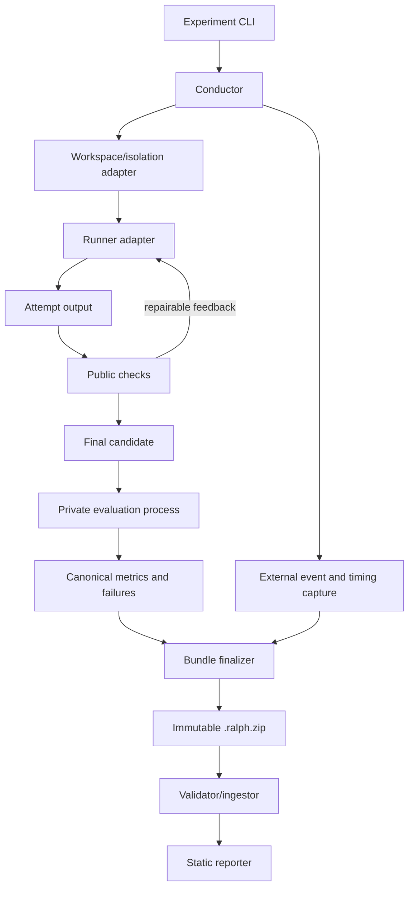

# P0 Skeleton Plan

**Status:** Proposed
**Date:** 2026-08-23
**Target:** One end-to-end local path and one end-to-end cloud path

## P0 objective

Build a greenfield vertical slice that can run the Busy Intersection and The
5x5 Rush, evaluate a candidate artifact under externally controlled traffic
load, preserve immutable evidence, and generate a skeletal static comparison
site.

P0 is an architectural proof, not the final benchmark release. It must make
the correct contracts difficult to undo later: run identity, attempts,
isolation metadata, challenge boundaries, canonical events, measurements,
bundle immutability, and report separation.

## Definition of done

P0 is complete when all of the following are true:

- `ralph run` can execute a versioned experiment specification.
- Repetitions receive unique run IDs and never overwrite one another.
- Agent work occurs in a staged workspace outside the source, results,
  references, and private judge-pack directories.
- Every run records an explicit isolation level and metric provenance.
- A fixture runner and generic command runner support deterministic tests.
- One real harness completes both a local-provider and cloud-provider run.
- The Busy Intersection and The 5x5 Rush use the same traffic evaluator API.
- The evaluator, not the artifact, supplies the trip demand schedule.
- Every requested trip is accounted for.
- Automated evaluation can advance simulation time deterministically.
- Traffic load rises through held stages until a defined failure boundary.
- The result includes breakdown capacity, peak sustainable throughput,
  ordinary-load delay, queue/spillback evidence, and recovery behavior.
- A controlled repair attempt can receive structured public-check feedback.
- Execution emits a versioned, checksummed `.ralph.zip` bundle.
- `ralph bundle validate` rejects malformed, unsafe, incomplete, or tampered
  bundles.
- `ralph build` consumes bundles and writes a separate static site without
  modifying source evidence.
- The site exposes the runnable artifact, standardized capture, acceptance
  evidence, performance curve, failures, resource usage, and provenance.
- Unit and integration tests run without a model account or inference server.

## Intended CLI

```bash
ralph run experiments/local-intersection.toml
ralph run experiments/cloud-city.toml
ralph bundle validate results/inbox/<run-id>.ralph.zip
ralph build --source results/inbox --output site
```

An experiment specification may expand into several runs:

```toml
schema_version = "experiment/v1"
challenge = "busy-intersection/v1"
runner = "opencode"
model = "model-id"
provider = "lmstudio"
repetitions = 3

[budget]
max_wall_seconds = 1200
max_attempts = 2

[evaluation]
scenario_pack = "traffic-local-p0"
```

Exact field names remain provisional until schemas are implemented and tested.

## Proposed implementation stack

- Python 3.11+ orchestration with type hints and a standard-library-first core.
- JSON Schema-compatible JSON documents for durable interchange contracts.
- Node.js plus Playwright for browser observation and capture.
- Static HTML/CSS/JavaScript output suitable for GitHub Pages.
- No database requirement in P0; a rebuildable local ingest cache may use
  SQLite from the Python standard library if needed.

## Proposed repository layout

```text
ralph-bench/
├── pyproject.toml
├── ralph_bench/
│   ├── cli.py
│   ├── experiments.py
│   ├── execution.py
│   ├── isolation.py
│   ├── attempts.py
│   ├── events.py
│   ├── metrics.py
│   ├── acceptance.py
│   ├── bundles.py
│   ├── challenges/
│   ├── reporting/
│   └── runners/
├── browser/
├── challenges/
│   ├── busy-intersection/
│   └── five-by-five-rush/
├── schemas/
├── experiments/
├── tests/
│   ├── fixtures/
│   └── artifacts/
├── docs/
└── site/
```

Private scenario packs, hidden checks, and reference implementations are not
stored in the public repository. P0 may load them from a separately configured
local path.

## Domain terminology

- **Experiment:** A declarative request that expands into one or more runs.
- **SUT:** Model, harness, provider/configuration, and effort/tool policy.
- **Run:** One SUT invocation for one challenge repetition. One immutable
  result bundle is produced per run.
- **Attempt:** One agent work interval within a run. A controlled repair loop
  may create more than one attempt.
- **Candidate:** The artifact state produced at the end of an attempt.
- **Scenario:** Evaluator-owned traffic demand, seed, timing, and profile used
  to test the final candidate.
- **Challenge pack:** Public prompt, constraints, starter assets, evaluator API,
  and public checks.
- **Judge pack:** Private scenarios, hidden checks, thresholds, and capture
  instructions.

## Architecture boundary



The agent process must not write authoritative metrics, final bundle metadata,
hidden check results, or reporter output.

## Work packages

### WP0 — Contracts and executable fixtures

**Deliverables**

- Initial schemas for experiment, run manifest, event, assertion, metric,
  failure, and bundle inventory.
- A fixed clock/ID injection mechanism for deterministic tests.
- Minimal passing, failing, malformed, and adversarial fixture artifacts.
- Terminology encoded consistently in types and filenames.

**Exit criteria**

- Schemas round-trip representative fixtures.
- Unknown schema versions fail clearly.
- Tests need no browser or provider.

**Estimate:** 2–3 engineering days.

### WP1 — Run identity, conductor, and attempts

**Deliverables**

- Experiment expansion and unique run IDs.
- Run state machine with explicit terminal reasons.
- Attempt directories and controlled feedback lifecycle.
- Independent monotonic wall-clock phase timing.
- Process limits and cleanup behavior.

**Exit criteria**

- Repetitions never collide.
- Interrupted runs retain diagnosable partial evidence.
- Failed attempts are preserved rather than overwritten.

**Estimate:** 3–5 engineering days.

### WP2 — Staged isolation and runner boundary

**Deliverables**

- Workspace materialization containing only public challenge inputs.
- Ephemeral home/config paths where supported.
- Environment allowlist and redaction.
- Fixture runner and generic command runner.
- Recorded isolation capability/limitations.

**Exit criteria**

- The workspace contains no source repo, prior results, references, or judge
  pack.
- The conductor retains logs outside the agent-writable evidence path.
- P0 isolation is truthfully labeled rather than overstated.

**Estimate:** 4–6 engineering days.

### WP3 — Immutable bundle pipeline

**Deliverables**

- Bundle staging, inventory, redaction, checksums, and deterministic finalization.
- Safe ZIP validation and extraction.
- Completeness and schema checks.
- No report HTML inside the evidence bundle.

**Exit criteria**

- A one-byte mutation fails checksum validation.
- Path traversal, duplicate entries, symlinks, and decompression limits are
  tested.
- Rebuilding a site does not change a source bundle.

**Estimate:** 3–5 engineering days.

### WP4 — Common browser and traffic protocol

**Deliverables**

- Pinned browser runtime and challenge dependency strategy.
- `traffic/v1` interface and event contract.
- Deterministic `advance()` evaluation mode and normal visual playback mode.
- Independent cross-checks for trip accounting, position, overlap, road/lane
  membership, and progress.
- Standard screenshot and WebM capture paths.

**Exit criteria**

- Fixture artifacts prove pass, failure, and dishonest/inconsistent telemetry
  paths.
- Fast-forward evaluation and visible playback use the same simulation state.

**Estimate:** 4–7 engineering days.

### WP5 — Busy Intersection vertical slice

**Deliverables**

- Public challenge pack and prompt.
- Private P0 scenarios and thresholds.
- Topology, signal, movement, pedestrian, safety, fairness, and queue checks.
- One standardized visual capture.
- Public structured feedback suitable for one controlled repair.

**Exit criteria**

- Passing and deliberately broken fixtures produce specific evidence.
- Several seeds yield deterministic results.
- The full run-to-bundle-to-site path works without the city challenge.

**Estimate:** 5–8 engineering days.

### WP6 — Adaptive load-to-failure engine

**Deliverables**

- Warm-up, held load stages, peak, cooldown, and recovery phases.
- Last-sustainable/first-failing bracket.
- Optional refinement runs inside the bracket.
- Transport and runtime failure classification.
- Capacity curve, normal-load quality, and recovery metrics.

**Exit criteria**

- Offered, admitted, active, completed, and backlogged trips reconcile.
- Temporary queues do not falsely count as immediate breakdown.
- Failure and recovery are reproducible for a fixed seed/profile.

**Estimate:** 4–6 engineering days.

### WP7 — The 5x5 Rush generalization

**Deliverables**

- Public frontier challenge pack.
- Grid, freeway, crossing, interchange, ramp, and OD-route validation.
- Balanced, inbound, and outbound P0 demand profiles.
- Ramp spillback, blocked-intersection, freeway collapse, fairness, and recovery
  checks.
- Overview and interchange captures.

**Exit criteria**

- The city evaluator is implemented as challenge logic over shared traffic
  contracts, not as special cases in the conductor.
- At least one fixture reaches a valid sustainable capacity and one fails via
  each critical spillback class.

**Estimate:** 6–10 engineering days.

### WP8 — Skeletal ingest and static reporting

**Deliverables**

- Bundle discovery, validation, quarantine, and ingest.
- Local/cloud top-level separation.
- Run detail page with artifact, capture, assertions, failures, metrics,
  throughput curve, attempts, and provenance.
- Combination aggregation with repetitions and sample counts.
- Performance-versus-resource Pareto chart.

**Exit criteria**

- Invalid bundles never silently enter official views.
- Missing and estimated metrics remain visibly labeled.
- Reports are deterministic for the same bundle set.

**Estimate:** 4–7 engineering days.

### WP9 — First real local and cloud paths

**Deliverables**

- One real harness adapter, proposed initially as OpenCode.
- Local OpenAI-compatible provider configuration, proposed initially as LM
  Studio.
- One metered cloud-provider configuration.
- Raw vendor evidence plus canonical external timing.
- End-to-end smoke experiments for both challenge tiers.

**Exit criteria**

- One local and one cloud bundle validate and render.
- Provider-reported and evaluator-derived metrics have explicit provenance.
- Harness configuration is scoped and restored or uses an ephemeral home.

**Estimate:** 4–7 engineering days.

### WP10 — Hardening and approval evidence

**Deliverables**

- Full unit/integration/end-to-end test pass.
- Threat-model and failure-injection results.
- P0 sample site.
- Known limitations and P1 backlog.
- Pilot threshold recommendations based on observed artifacts.

**Estimate:** 3–5 engineering days plus model run time.

## Sequencing

```text
WP0 -> WP1 -> WP2 -> WP3
                 \-> WP4 -> WP5 -> WP6 -> WP7
WP3 + WP5 + WP6 -------> WP8
WP1 + WP2 + WP4 -------> WP9
all --------------------> WP10
```

The recommended implementation checkpoints are:

1. **P0-A infrastructure:** WP0–WP4.
2. **P0-A vertical slice:** WP5–WP6 plus minimal WP8.
3. **P0-B generalization:** WP7.
4. **Real-system proof:** WP9.
5. **P0 release candidate:** complete WP8 and WP10.

## Test strategy

### Unit tests

- Schema and version handling.
- Experiment expansion and IDs.
- Run/attempt state transitions.
- Event normalization and timing.
- Metric calculations and failure thresholds.
- Checksum and ZIP validation.
- Redaction and path validation.

### Fixture artifact tests

- Clean passing intersection.
- Collision, red-light, starvation, trip-loss, queue, and deadlock failures.
- Clean passing city.
- On-ramp spillback, off-ramp spillback, disconnected graph, invalid route,
  blocked grid, and non-recovery failures.
- Artifact that reports dishonest counters inconsistent with vehicle state.

### Integration tests

- Fixture runner through bundle finalization.
- Public check feedback through a second controlled attempt.
- Browser evaluator through deterministic fast-forward and capture.
- Bundle ingest through static page generation.

### End-to-end smoke tests

- One real local model/harness/provider run.
- One real cloud model/harness/provider run.
- At least two repetitions proving no overwrite and valid aggregation.

## P0 non-goals

- Google Drive or other remote artifact stores.
- Strong OS-level sandbox support on every platform.
- Every runner from the legacy benchmark.
- A legacy corpus importer.
- A frontier-model qualitative judge.
- A polished public design system.
- A universal composite overall score.
- City pedestrians, parking, incidents, emergency vehicles, or road closures.
- Energy measurement or infrastructure-normalized throughput.

## Primary risks and mitigations

| Risk | P0 mitigation |
|---|---|
| Agent fabricates telemetry | Cross-check trip IDs, visible/entity position, network membership, and event reconciliation; label the remaining trust boundary. |
| Thresholds encode arbitrary preferences | Keep thresholds in versioned judge packs and calibrate using fixtures and pilot runs. |
| Fast-forward diverges from visible behavior | Require one state/update path and test fast-forward state against normal playback. |
| Cross-platform isolation is inconsistent | Record capabilities and isolation level; exclude unsealed results from official views. |
| Vendor metrics are missing or incomparable | Measure wall phases independently and attach provenance/confidence to every vendor metric. |
| City task overwhelms core development | Finish the intersection vertical slice before implementing city-specific checks. |
| Public repository leaks hidden material | Keep judge packs and reference implementations outside the public repository. |
| Optimization rewards unrealistic roads | Fix physics and infrastructure envelopes in versioned challenge definitions. |

## Estimated effort

The P0-A intersection vertical slice is expected to require roughly three to
four full-time engineering weeks. P0-B city generalization and complete
reporting add roughly two to four weeks. A realistic P0 range is **five to
eight engineering weeks**, excluding elapsed model execution and calibration
time.

## Approval checklist

Before implementation begins, approve or amend these proposed choices:

- [ ] Python conductor with Node/Playwright browser worker.
- [ ] Immutable `.ralph.zip` bundle per run.
- [ ] Separate public challenge packs and private judge packs.
- [ ] Staged isolation in P0 with stronger OS sandboxes deferred.
- [ ] Fixture runner, generic command runner, then OpenCode as first real
      adapter.
- [ ] LM Studio as the first local provider path.
- [ ] Busy Intersection completed before city-specific evaluator work.
- [ ] No single composite overall score in P0.
- [ ] Google Drive, qualitative model judging, and legacy import deferred.
