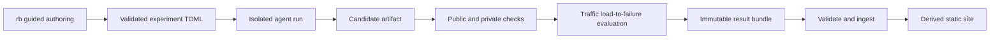

# Ralph Bench Vision

**Status:** Proposed
**Date:** 2026-08-23

## Purpose

Ralph Bench evaluates complete agentic coding systems: model, harness,
provider configuration, effort/tool policy, and execution environment. It is
designed for a world in which capable models often satisfy superficial checks
and conventional benchmark scores cluster near the top.

The benchmark asks a more useful question:

> How reliably does a model-and-harness combination produce original,
> accepted work, how well does that work perform, and how much local time or
> cloud cost does success require?

The initial benchmark uses browser-based visual traffic simulations because
they combine spatial reasoning, state management, scheduling, routing,
debugging, information design, and software craftsmanship with a result that
humans can understand at a glance. The local intersection may be 2D, 2.5D, or
3D; the frontier city is intended as a grand spatial showcase.

## Product principles

### Validity precedes scoring

A contaminated, unverifiable, or structurally invalid run is not a low-scoring
success. It is ineligible for an official ranking. Isolation level, provenance,
and metric quality are first-class result data.

### Correctness is a gate, not a trade

Fast failures and attractive broken artifacts must not outrank correct work.
Critical acceptance criteria are gates. Performance and resource efficiency
differentiate eligible results.

### Performance should reflect good design

The traffic challenges have an in-simulation optimization target:
**sustainable valid vehicle throughput**. The evaluator increases externally
controlled traffic demand until the artifact reaches a defined breakdown
condition, then measures whether it recovers.

### Reliability needs repeated evidence

One run is an anecdote. Experiments produce uniquely identified repetitions,
preserve failures, and report distributions, sample counts, and metric
provenance.

### Local and cloud results are different products

Local results prioritize time-to-green and are compared within an exact
hardware and provider-configuration cohort. Every cloud result requires a
declared cost policy. Metered runs use attributable provider charges or a
complete price derivation; subscription runs use an explicit share of a flat
plan/campaign cost. Marginal charge, allocated cost, provider credits, and API
list-price equivalents remain visibly distinct.

### The artifact remains available to human judgment

Deterministic checks establish validity and measurable behavior. Standardized
captures and runnable artifacts let people judge physical plausibility,
legibility, creativity, and the everyday fidelity of the simulation. Layout,
composition, color, typography, information hierarchy, motion, atmosphere,
polish, originality, and delight are legitimate dimensions of excellence. They
remain separate from traffic correctness: visual beauty cannot rescue an
invalid simulation, and technical success does not automatically imply a
compelling human experience.

### Evidence is immutable; reports are derived

Execution produces a versioned, checksummed bundle. Reporting consumes bundles
and writes a separate static site. It never edits, truncates, or adds HTML to
the source evidence.

### The common path is guided; the execution path is declarative

`rb` with no arguments helps the user choose a client first, discover
compatible providers and models, complete the remaining controls, and save a
validated experiment TOML file. That file is the reproducibility boundary.
Explicit runs do not depend on remembered interactive answers, and discovery
never performs billable generation work or stores secrets.

### Configuration has one owner and one lifecycle

The conductor resolves one normalized experiment into provider and client
actions. Provider adapters configure and observe the services they own;
harness adapters render only their own scoped native client configuration.
Requested, materialized, effective, and cleanup states remain distinct
evidence. Ralph Bench does not reproduce a collection of harness-specific
provider setup paths
or silently depend on user-global configuration.

### Harnesses, providers, and models compose polymorphically

Each SUT axis implements its own typed adapter contract and advertises
versioned capabilities. A resolver composes compatible harness, provider, and
model implementations into one explicit SUT plan. The conductor, wizard, and
reporter operate on those contracts rather than vendor-name branches or a
cross-product of bespoke runners. Model support is primarily declarative, with
a conservative generic path for unknown models.

### Challenge contracts stay small

Difficulty comes from behavior, scenario variation, hidden holdouts, and
optimization under constraints—not from enormous prompts that prescribe an
implementation line by line. A challenge defines outcomes, infrastructure
limits, and a small evaluator API while leaving architecture and visual design
open.

### Evaluator truth is independent of agent claims

Agent-authored explanations and telemetry can aid debugging, but authoritative
metrics are evaluator-derived or independently cross-checked. Requested trips,
browser observations, events, artifacts, and process measurements remain
separate evidence sources.

## Evaluation hierarchy

Ralph Bench keeps distinct dimensions rather than prematurely flattening them
into a single opaque number:

1. **Validity** — isolation, provenance, originality, and evidence integrity.
2. **Acceptance** — critical functional and runtime requirements.
3. **Artifact performance** — traffic capacity, delay, fairness, and recovery.
4. **Agent reliability** — pass rate across repetitions and scenarios.
5. **Agent efficiency** — time-to-green locally or cost-to-green in cloud runs.
6. **Qualitative judgment** — visual fidelity, coherence, and human preference.

The initial site will present separate leaderboards and a performance/resource
Pareto view. A single composite overall score is deliberately deferred until
pilot data shows that one would be honest and useful.

## Initial challenge ladder

### Busy Intersection

A compact four-way traffic simulation for local and smaller models. It tests
continuous vehicle motion, traffic signals, turning movements, queues,
pedestrians, fairness, and safe throughput in a bounded scene. The presentation
may be an exceptionally polished 2D graphic, a dimensional 2.5D visualization,
or a full 3D environment; it is judged by visual effectiveness rather than by
technology choice.

### The 5x5 Rush

A frontier challenge in which a five-by-five-block city is bisected by a
grade-separated freeway with complete on- and off-ramp connections. It adds
origin-to-destination routing, multiple signals, freeway merging, interchange
design, spillback containment, network-wide congestion, and post-peak
recovery. It is also the grand visual challenge: a model city whose spatial
design, atmosphere, motion, and information layer should make complex network
behavior inviting and memorable.

The two challenges share a traffic evaluation protocol so the smaller task
proves the unit behavior that the larger task composes into a network.

## System under test

The ranked unit is a **system under test (SUT)**:

```text
model x harness x provider/configuration x effort/tool policy
```

Hardware, operating system, runtime versions, and local inference settings are
recorded as the execution environment. Local time comparisons require a
matching environment cohort; cloud comparisons retain provider and service-tier
context.

The proposed live P0 composition is Codex CLI with ChatGPT-managed OpenAI
access and `gpt-5.6-luna`. It is a flat-subscription cloud cohort whose primary
cost is allocated under an explicit versioned policy. All other real harness,
provider, and model integrations remain TBD while fake adapters prove the
generic composition contracts.

## Core workflow



## Success for the project

Ralph Bench succeeds when a reader can answer, without reverse-engineering a
report:

- Did the artifact genuinely work?
- Was the run eligible and uncontaminated?
- How much traffic could the design sustainably serve?
- What failed first under overload?
- Did the network recover?
- How often did this model/harness combination succeed?
- How long or how much money did it take?
- What hardware, provider, and configuration produced the result?
- What did the artifact actually look and feel like?
- Did its layout, visual language, motion, and information design create a
  compelling experience without obscuring the traffic mission?

## Explicit non-goals for P0

- Migrating every legacy runner.
- Producing a universal one-number intelligence score.
- Building a full traffic-engineering research simulator.
- Treating agent-authored counters as authoritative.
- Publishing hidden scenarios or reference implementations.
- Supporting remote artifact stores such as Google Drive.
- Adding a frontier-model qualitative judge before deterministic evidence is
  stable.
- Normalizing published token rates and percentage of daily, weekly, or
  rolling plan quota consumed across subscription tiers.
